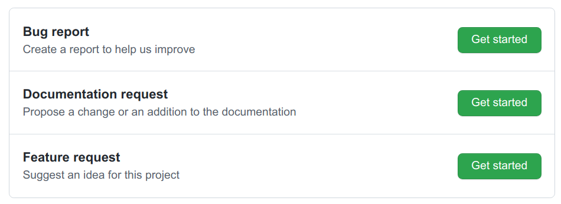

Filing Bugs and Enhancement Requests
************************************

Freeciv21 certainly contains some bugs and definitely needs improvements. Please report all you find or want
to report to https://github.com/longturn/freeciv21/issues/new/choose.

The project team has implemented GitHub Issue Templates to make the process as easy as possible. We currently
have 3 different ones: Bug Report, Documentation Request, and Feature Request. Each template has prompts to
help you fill in the details. See an example screen shot below.

Reporting an Issue
==================

The Freeciv21 project uses GitHub issues to track bugs, enhancement requests and documentation requests. Take
note of the following when thinking of submitting an issue.

* Check that it is not listed as a known issue. For a continuously updated list, see:
  https://github.com/longturn/freeciv21/issues

* Check the Freeciv21 Releases page at https://github.com/longturn/freeciv21/releases, to ensure you're
  playing the latest version. We may have already fixed the problem.

* If the first two items don't work, then feel free to submit a new issue. We have implemented GitHub issue
  templates so they will walk you through the major aspects of a new issue. It is important to note that the
  more details you can provide, the better. If a screen shot is available, then by all means supply it to us.

  * If you are an advanced hacker, you can also providde a core dump or stack trace to better help the
    developers of Freeciv21 understand the nature of the issue.

  * If there is an issue in a translation, please report it. We are still getting organized with
    internationalization (i18n) support for the client and server. The more we know the better.
