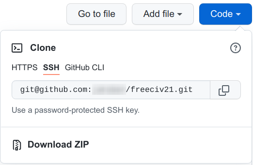

..
    SPDX-License-Identifier: GPL-3.0-or-later
    SPDX-FileCopyrightText: 2022 James Robertson <jwrober@gmail.com>

Set up a Development Environment
********************************

Contributing code to the Freeciv21 project or contributing to any of the games that the Longturn community
manages requires a bit of setup. This document should get you up and running with the basics. It should be
noted, that you typically only have to go through this process once unless you setup a new workstation.

Workstation
===========

Freeciv21 can be developed on Linux, Windows, and macOS. Any current version of these OS's is acceptable. For
Windows, you will need to setup either the MSYS2 environment or Visual Studio to do development.
Refer to :doc:`msys2` or :doc:`Visual Studio <visual-studio>` for more information. It should be generally
understood that :strong:`Linux` is the preferred development platform. For a complete set of installation
steps, you can refer to :doc:`/Getting/compile`.

Technically all you need is a text editor of some kind to edit the files, but most people prefer to use an
integrated development environment (IDE).

All platforms can use `KDevelop <https://www.kdevelop.org/download>`_. However, there are some caveats:

* On Windows, due to the nature of the integration with MSYS2, native compilation and debugging is not
  supported. This is resolved with :doc:`Visual Studio <visual-studio>` as the IDE.
* On macOS, KDevelop is still considered experimental. Many Mac users
  use `XCode <https://developer.apple.com/xcode/>`_.

For the best results, especially if you are editing game code and not just Longturn game rulesets or
documentation, you will want :strong:`Linux` to be your workstation OS. Many of the current developers use a
Debain variant such as Ubuntu. Instructions for getting all of the tools needed for Debian Linux can be found
in :doc:`/Getting/compile`. Do not follow the steps to clone the repository (e.g. the :code:`git clone`
command), that will happen in a bit.

GitHub
======

The Longturn Community uses the online source code control and revision system known as
`GitHub <https://github.com/>`_. To contribute, you will need an account on this platform. There is no cost.

With an account, you can go to the `Longturn <https://github.com/longturn>`_ community repository page and
:strong:`fork` a repository (such as the Freeciv21 repository) to your personal GitHub account. Go to the main
page of the repository you want to fork and you will find a :strong:`fork` button in the upper-right corner.

In order to get code pushed to the forked repository to your local workstation, you need to setup an
SSH key pair to share with GitHub. Follow these
`instructions <https://docs.github.com/en/authentication/connecting-to-github-with-ssh>`_.

With SSH set up, now it is time to clone the forked repository from your personal GitHub account to a local
copy on your workstation.

First make a working directory to place the files in:

.. code-block:: sh

  $ mkdir -p $HOME/GitHub

  $ cd $HOME/GitHub

You can get the appropriate path by going to your forked copy in a browser, click the code button and then
select the SSH option as shown in this sample screenshot:

.. GitHub Clone SSH:

    GitHub Clone SSH

Once you have the proper path, here is the command to clone the repository:

.. code-block:: sh

  ~/GitHub$ git clone git@github.com:[username]/freeciv21.git

This will clone the forked repository to the :file:`~/GitHub/freeciv21` directory on your computer.

The final repository setup item is to link the original Longturn project repository to your local area on
your computer:

.. code-block:: sh

  ~/GitHub/freeciv21$ git remote add upstream https://github.com/longturn/freeciv21.git

You will also need to set a couple global configuration settings so :code:`git` knows a bit more about you.

.. code-block:: sh

  ~/GitHub/freeciv21$ git config --global user.email [email address associated with GitHub]
  ~/GitHub/freeciv21$ git config --global user.name [your first and last name]

KDevelop Project Setup
======================

On Linux, the easiest way to install KDevelop is with a command such as this:

.. code-block:: sh

    sudo apt install kdevelop

Once installed, you can then import the Freeciv21 project into it. Follow these steps:

#. Open Kdevelop
#. :menuselection:`Project --> Open/Import Project`
#. Find :file:`freeciv21/CMakeLists.txt`
#. :menuselection:`Session --> Rename Current Session` to Freeciv21
#. Allow kdevelop to parse all of the code. This can take a while. Eventually you will see a full tree of
   the code in the Projects tab on the left.

Here are some useful help/documentation links:

* https://userbase.kde.org/KDevelop5/Manual
* https://docs.kde.org/trunk5/en/kdevelop/kdevelop/kdevelop.pdf

Now you are ready to edit some code! When ready, follow the steps to submit a pull request here:
:doc:`pull-request`.

Qt Creator
===========

Freeciv21 uses the Qt framework for many things, especially the game client. There are many :file:`.ui` files
in the :file:`client` directory. If you want to edit those in a user interface (versus editing the raw XML),
you will want to install Qt Creator. You do so with a command such as this:

.. code-block:: sh

    sudo apt install qtcreator

Once installed you will get access to a program called :strong:`Qt Designer`. This tool is a graphical
interface you can use to edit the :file:`.ui` files. You also gain access to Qt documentation inside of
KDevelop as well. You can read the Qt Designer Manual for more help here:
https://doc.qt.io/qt-5/qtdesigner-manual.html
