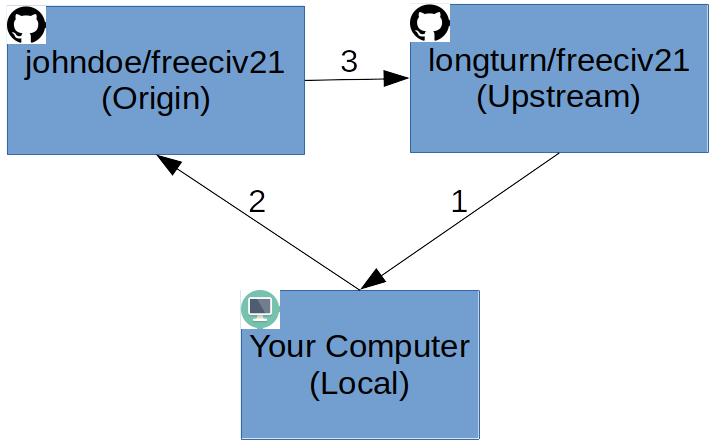

How to Submit a Pull Request
****************************

A Pull Request (PR), also commonly known as a Merge Request, is a mechanism to "pull" code from one repository
into another one and merge the change into the source repository.

Before we go much further, let's take a few minutes to describe what happened when you :doc:`dev-env` and to
define a few terms that will help with further instructions. Starting with a diagram of the setup of the three
locations where code resides:

As part of the :doc:`../General/install` process, one of the programs installed is :file:`git`. This program
is used to interact with the varying places that code can reside. The :file:`git` program has a relatively
standard way of referring to things that are in the diagram. If you have not worked with :file:`git` much,
it is highly recommended you read the first three chapters of the
`Pro Git Book <https://git-scm.com/book/en/v2>`_ before continuing.

* :strong:`Upstream`: This refers to the source (original) repository. For us this is the Longturn Freeciv21
  or Games repositories.
* :strong:`Origin`: This refers to the fork you made in your own personal GitHub account.
* :strong:`Local`: This isn't a :file:`git` term per se, but is a well understood industry standard way of
  referring to the copy of code on a person's computer. This is where the changes are made and eventually
  make it back up to origin and over to upstream via a Pull Request.

The arrows represent the path that updates (e.g. changes) of files occurs.

1. File updates from `Upstream` are downloaded (pulled) to `Local`.
2. After changes are made, file updates from `Local` are uploaded (pushed) to `Origin`.
3. File updates from `Origin` are transferred to `Upstream` laterally via a Pull Request.

With this in mind, submitting a Pull Request generally entails these steps:

#. Update Local with the lastest from Upstream.
#. Create a branch from Upstream.
#. Edit files as needed in Local.
#. Push the changes in a commit to Origin.
#. Requesting a Pull Request from Origin to Upstream.

1. Update Local With The Lastest Updates From Upstream
======================================================

Assuming you are in the appropriate Local directory, issue these commands to get the latest code from Upstream:

.. code-block:: rst

  ~/GitHub/freeciv21$ git checkout master
  ~/GitHub/freeciv21$ git pull upstream master --ff-only

.. note::
  If you want :code:`git pull` to always do a "fast-forward" (which is preferred), you can set a local
  repository configuration option with this command: :code:`git config --local pull.ff only`. You only need to
  do this once. After the config is set, you can drop the :code:`--ff-only` option from the last command above.

2. Create A Branch From Upstream
================================

Now that things are all up to date with the lastest code, let's create a branch to do your work in.

.. code-block:: rst

  ~/GitHub/freeciv21$ git checkout -b [some_feature] upstream/master

The tag :code:`[some_feature]` should be replaced by something that matches what you are planning to work on.
For example, it could be as easy as :code:`issue_123`, meansing that this branch is changes to resolve GitHub
Issue 123 in the Freeciv21 Issues list.

.. attention::
  It is recommended to never make changes in the master branch. Best practice is to make changes in a
  different branch. This makes it much easier to evaluate changes as part of the Pull Request evaluation
  process and keeps things much cleaner from a repository management perspective.

3. Edit Files As Needed In Local
================================

This step is as simple as it sounds. Edit the files in the Local area as needed to complete the work you
want to work on. Depending on what you are doing, there is a high likelyhood that you will want to compile
the code to test your work. Here are some quick steps that you can use to run through quick compiles of code
and/or documentation updates.

.. code-block:: rst

  ~/GitHub/freeciv21$ clang-format
  ~/GitHub/freeciv21$ rm -Rf build
  ~/GitHub/freeciv21$ cmake . -B build -G Ninja -DCMAKE_INSTALL_PREFIX=$PWD/build/install
  ~/GitHub/freeciv21$ cmake --build build
  ~/GitHub/freeciv21$ cmake --build build --target install
  ~/GitHub/freeciv21$ cmake --build build --target docs

The first command, :file:`clang-format`, runs a pre-processor to format any code changes to support the
Longturn community's code standards.

The second command cleans out the :file:`build` directory to start fresh. The third command runs a configure
process and then sets things up to do the install portion inside the same :file:`build` directory, keeping
work in progress all in one place.

The forth and fifth command compile and installs the code. The last command is used to generate the
documentation that you are reading right now. You can open :file:`./build/docs/index.html` to see a locally
generated copy of the documentation prior to pushing a change up.

.. note::
  You don't have to start from the top of the list of commands every time you want to check on things. If you
  have already done a full pass to install and then make some more changes. You can go straight to the build
  and install commands. The :file:`cmake` program is smart enough to determine what changed and only compile
  those files again. It's much faster to do things this way!

One more thing to note here, this section is only talking about making changes to the Freeciv21 repository and
has not really talked about the Games repository, nor talked about Rulesets or Tilesets. In this scenario,
there isn't any compiling going on. The Ruleset or Tileset editor is editing files and testing locally. The
Longturn Games repository is effectively a repository of Rulesets.

4. Push The Changes In A Commit To Origin
=========================================

Now the moment arrives, you have a fully completed set of changes you want to share! The next step is to
evaluate what all has changed and build a commit. A commit is an organized set of changes all bundled up
together. There are lots of ways to organize commits, for this set of instructions we are going to assume
that all of your changes are going to be bundled into one commit. If you want to learn how to build more than
one commit into a Pull Request then you can read about `git add <https://git-scm.com/docs/git-add>`_ and
`git commit <https://git-scm.com/docs/git-commit>`_. Most of the work is handled with :file:`git add`.

.. code-block:: rst

  ~/GitHub/freeciv21$ git status
  ~/GitHub/freeciv21$ git add --all
  ~/GitHub/freeciv21$ git commit

The :file:`git status` command is used to list out all the changes that :file:`git` has seen. Changed files,
new files, moved files, etc. are all listed. This command comes in handy when you want to organize your Pull
Request into more than one commit. It's also very useful to ensure that what you see as changed follows along
with what you THINK you have actually changed. Sometimes in the course of editing you may inadvertantly made
a change to another file that you didn't intend to actually change. If you find that you accidentially changed
a file, you can use the :file:`git restore <file>` command. This is also shown on the :file:`git status`
command output.

Once everything looks good from a :file:`git status` perspective, then issue the last two commands. The last
command, :file:`git commit` will open a text editor (in Debian based systems this is often Nano). Put a message
at the bottom below all of the hashes ( # ) and then save.

At this point you have a commit of changes that you need to push to Origin.

5. Requesting A Pull Request From Origin To Upstream
====================================================

This is the last major step in the process. To push the commit to your fork, issue this command:

.. code-block:: rst

  ~/GitHub/freeciv21$ git push origin

You will be prompted for your SSH passkey and then the changes in the branch you created in step 3 will be
pushed to your fork. Once complete, you can open your fork in a web browser and GitHub will notice the
change and prompt you to open a Pull Request. The complete steps are documented
here: https://docs.github.com/en/pull-requests/collaborating-with-pull-requests/proposing-changes-to-your-work-with-pull-requests/creating-a-pull-request-from-a-fork.
