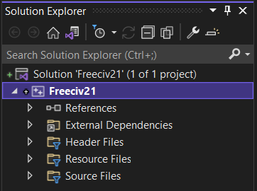
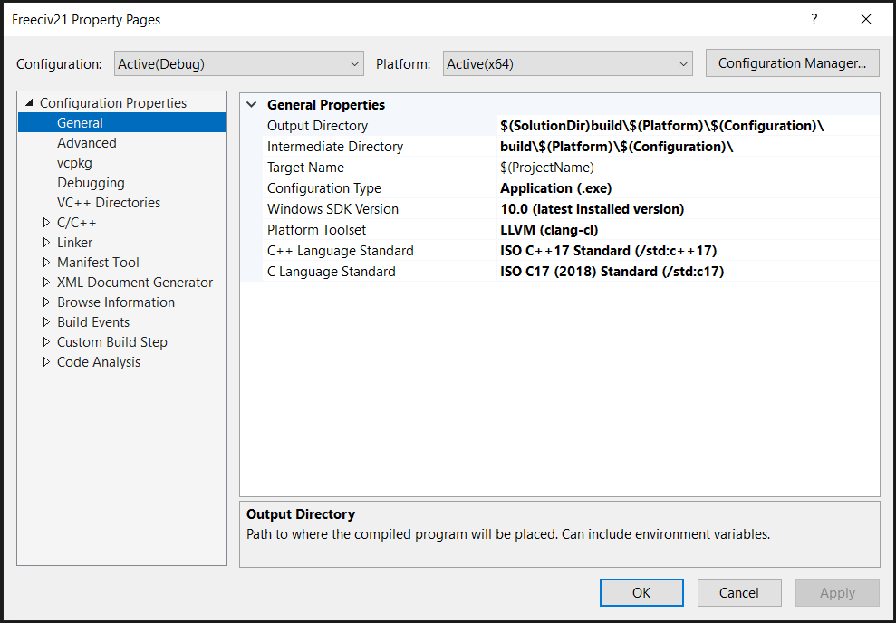
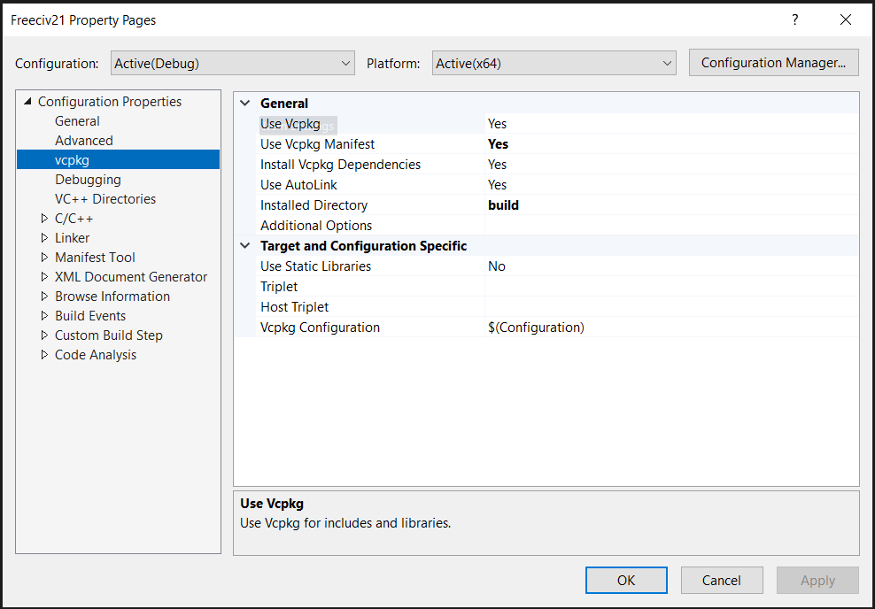

Setting up Visual Studio
************************

Freeciv21 can be compiled using Microsoft Visual Studio |reg| and :file:`clang`. This page will help you
get version 2022 up and running.

.. warning:: Visual Studio and the corresponding dependencies require a great deal of HDD space on your
    computer. Be sure to have at least 40GB of available space before starting this process.

Base Installation
=================

Start by `downloading <https://visualstudio.microsoft.com/vs/community/>`_ the Community Edition installer.

Double-click the :file:`VisualStudioSetup.exe` file in your Downloads directory and follow the prompts to
get the setup process started. At some point you will be prompted to select the type of workload you want to
install. Select :guilabel:`Desktop development with C++`.  Next click on the Individual components tab and
select the following options: :guilabel:`git for Windows`, :guilabel:`C++ Clang Compiler for Windows (13.0.0)`
, and :guilabel:`C++ Clang-cl for v143 build tools (x64/x86)`.

When ready click :guilabel:`Install`. Depending on your Internet connection speed, this may take awhile.

When the installation process is finished you will be presented with a collection of options. Goto the very
bottom right and click the link to :strong:`continue without code`.

Setup VCPKG
===========

:file:`vcpkg` is a library package manager developed by Microsoft. It makes downloading and installing
third-party libraries much easier. Freeciv21 uses :file:`vcpkg` in this way via the manifest file
:file:`vcpkg.json`.

First, create a directory on your computer to install :file:`vcpkg` into. For example: :file:`C:\\Tools`.
The directory can be anywhere, however the author prefers to not install things in the root of the :file:`C:\\`
drive.

Inside Visual Studio click :menuselection:`View --> Terminal`. Then get into the directory you created.

.. code-block:: rst

    PS C:\Users\[user]\Source\Repos> cd c:\tools
    PS C:\Tools>

Now follow the directions: https://github.com/microsoft/vcpkg#quick-start-windows. The work should be performed
in the terminal widget inside Visual Studio.

Here is an abbreviated set of steps:

.. code-block:: rst

    Tools> git clone https://github.com/microsoft/vcpkg
    Tools> .\vcpkg\bootstrap-vcpkg.bat
    Tools> .\vcpkg\vcpkg integrate install
    Tools> .\vcpkg\vcpkg integrate powershell
    Tools> exit

GitHub
======

The Longturn.net Community uses the online source code control and revision system known as
`GitHub <https://github.com/>`_. To contribute, you will need an account on this platform. There is no cost.

With an account, you can go to the `Longturn <https://github.com/longturn>`_ community repository page and
:strong:`fork` a repository (such as the Freeciv21 repository) to your personal GitHub account. Go to the main
page of the repository you want to fork and you will find a :strong:`fork` button in the upper-right corner.

In order to get code pushed to the forked repository to your local workstation, you need to setup an
SSH key pair to share with GitHub. Follow these
`instructions <https://docs.github.com/en/authentication/connecting-to-github-with-ssh>`_.

With that set up, now it's time to clone the forked repository from your personal GitHub account to a local
copy on your workstation. The typical way to do this is with the :code:`https` protocol. However, this only
works if you want to download a copy of a repository and not push any changes back up. To do that, you have to
use the :code:`ssh` protocol instead.

Now you want to clone the respository. You can get the appropriate command by going to your forked copy in a
browser, click the code button and then select the SSH option as shown in this sample screenshot:

.. image:: ../_static/images/github_clone_ssh.png
    :align: center
    :height: 250
    :alt: GitHub Clone SSH

Select :menuselection:`View --> Terminal` to open a terminal in the IDE. Once you have the proper path, here
is the command to clone the repository:

.. code-block:: rst

  PS C:\Users\[user]\Source\Repos> git clone git@github.com:[username]/freeciv21.git

This will clone the forked repository to the :file:`C:\\Users\\[User]\\Source\\Repos\\freeciv21` directory on
your computer.

The final repository setup item is to link the original Longturn project repository to your local area on
your computer:

.. code-block:: rst

  Repos> cd freeciv21
  Repos\freeciv21> git remote add upstream https://github.com/longturn/freeciv21.git

You will also need to set a couple global configuration settings so :code:`git` knows a bit more about you.

.. code-block:: rst

  freeciv21> git config --global user.email [email address associated with GitHub]
  freeciv21> git config --global user.name [your first and last name]

Build Visual Studio Solution
============================

Select :menuselection:`Git --> Local Repositories --> Select Local Repository` and then select the
:file:`freeciv21` folder. Visual Studio will take a minute to parse the source tree.

Select :menuselection:`File --> New --> Project from Existing Code`. Select :guilabel:`Visual C++`, Click
:guilabel:`Next`, and then select the :file:`freeciv21` folder and give it a name. Click :guilabel:`Finish`
when done. Visual Studio will create a solution file. It can take a few mintues for this to complete. You can
look at the background tasks widget to see the progress.

Configure the Solution Properties
=================================

On the right you will see :guilabel:`Solution Explorer` and the solution named :emphasis:`Freeciv21` that was
created with the last step in the previous section. If you do not see the :guilabel:`Solution Explorer`, then
you can open with by clicking :menuselection:`View --> Solution Explorer`.

Right-Click on the ``Freeciv21`` Project and select :guilabel:`Properties`. Select the page shown in the screen
shot below. Change all the :strong:`bold` settings to match on your setup.

Select the page shown in the screen shot below. Change all the :strong:`bold` settings to match on your setup.
Notice the installed directory path to the :file:`vcpkg`. Ensure to match what you did earlier.

Complete
========

At this point you should have a fully configured Visual Studio and can :strong:`Build` Freeciv21 from the
:emphasis:`Solution Explorer` or the Build menu.  The very first time you do this Visual Studio will use the
vcpkg manifest file, :file:`vcpkg.json`, to download and compile all of the library dependencies needed to
build Freeciv21. This will take a very long time. On a fast computer with a good Internet connection it will
take at least 3 hours to complete. Everything will be downloaded and compiled into the :file:`C:\\Tools\\vcpkg`
directory, or wherever you configured :file:`vcpkg` earlier. Binaries for the packages will be copied into the
:file:`./build/` directory inside of the main Freeciv21 directory and reused for subsequent builds.

.. |reg|    unicode:: U+000AE .. REGISTERED SIGN
