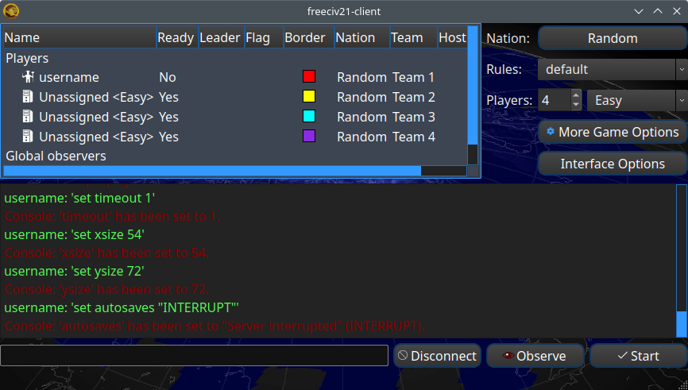
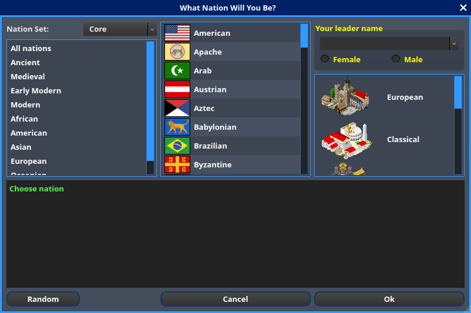

Freeciv21 Client Manual
***********************

.. Custom Interpretive Text Roles for longturn.net/Freeciv21
.. role:: unit
.. role:: improvement
.. role:: wonder

The Freeciv21 client (``freeciv21-client``) is the main user interface that allows one to play single-player
and online multi-player games. This manual will mostly track what is in the ``master`` branch of the Freeciv21
GitHub Repository at https://github.com/longturn/freeciv21/tree/master.

This manual was last updated on: 07 August 2022 correlating to the ``master`` branch at b1f1881. The
``master`` branch is post v3.0-beta.3.

Getting started
===============

If you have not installed Freeciv21, then obviously you need to start :doc:`there <../install>`. Precompiled
binaries are available for tagged releases and can be found on the LongTurn GitHub Repository for Freeciv21 at
https://github.com/longturn/freeciv21/releases. The LongTurn community provides binary packages for Debian
based Linux distros (Debian, Ubuntu, Mint, etc.), Windows and MacOS. If you are an Arch Linux user, you can
find Freeciv21 in AUR. If you want to get code that is closer to the ``master`` branch, you will want to
compile the code yourself. The :doc:`installation <../install>` document is mostly for Linux. However, you can
also compile on Windows with the :doc:`MSYS2 <../../Contributing/msys2>` environment or Microsoft :doc:`Visual
Studio <../../Contributing/visual-studio>`.

If you are having trouble, come find the LongTurn Community on Discord at https://discord.gg/98krqGm. A good
place to start is the ``#questions-and-answers`` channel.

Launching the Client
====================

Depending on how you installed Freeciv21 will determine how you launch it. If you installed with one of the
precompiled binary packages, then you should find Freeciv21 in your OS's launcher, Start Menu, etc. If you
compiled the code yourself, then you will go to the location you asked ``--target install`` to place the
files. Double-clicking ``freeciv21-client`` should start it up.

.. figure:: ../../_static/images/gui-elements/start-screen.png
    :height: 400px
    :align: center
    :alt: Freeciv21 Start Screen
    :figclass: align-center

    Figure 1: Start Screen with NightStalker Theme

The following buttons are available on the :guilabel:`Start Screen`:

* :guilabel:`Start new game` -- Start a new single-player game. See `Start new game`_ below.
* :guilabel:`Connect to network game` -- Connect to a LongTurn mutli-player game or one you host yourself. See
  `Connect to network game`_ below.
* :guilabel:`Load saved game` -- Load a previously saved single-player game. See `Load saved game`_ below.
* :guilabel:`Start scenario game` -- Start a single-player scenario game. See `Start scenario game`_ below.
* :guilabel:`Options` -- Set local client options. See `Options`_ below.
* :guilabel:`Quit` -- Quit Freeciv21

.. Note:: Notice that there is not a :guilabel:`Help` button available. This is by design. The in-game help is
  compiled at run-time based on the ruleset you select and other server settings you may set.

Start New Game
--------------

Clicking :guilabel:`Start new game` will cause the client to spawn a local ``freeciv21-server`` instance in
the background and then the following dialog will appear.

    Figure 2: Start New Game Dialog

From upper-left to lower-right, the following user interface elements are available:

* :guilabel:`Players list`
* :guilabel:`Nation`
* :guilabel:`Rules`
* :guilabel:`Number of Players`
* :guilabel:`AI Skill Level`
* :guilabel:`More Game Options`
* :guilabel:`Client Options`
* :guilabel:`Server output window`
* :guilabel:`Server chat/commmand line`
* :guilabel:`Disconnect`
* :guilabel:`Pick Nation`
* :guilabel:`Observe`
* :guilabel:`Start`

Players List
^^^^^^^^^^^^

The :guilabel:`Players list` table shows information about the configured players in the game. The information
shown in Figure 2 is what a single-player game looks like. A LongTurn multi-player game will look very
similar, except that all the player's aliases will be shown as setup by the game administrator.
You can right-click on a player's row to configure details about the specific player:

* :guilabel:`Observe` -- Allows you to connect to a running game and observe that player. This is useful
  during LongTurn multi-player games when you want to connect and see what a player is doing, but you cannot
  make any actual moves for the player. This works for LAN games as well. You can also use the server
  chatline and issue this command: ``/observe <player>``.
* :guilabel:`Remove player` -- Removes the player from the list.
* :guilabel:`Take this player` -- Allows you to claim this player as your own and then when you click
  :guilabel:`Start` you will join the game as that player. This is a required step for LongTurn multi-player
  games at start of a new game. Subsequent logins to a game when you `Connect to Network Game`_ will not
  require another take action. You can also use the server chatline and issue this command: ``/take <player>``
* :guilabel:`Pick nation` -- Allows you to `Pick Nation`_.
* :guilabel:`Set difficulty` -- Set the difficulty of the AI.
* :guilabel:`Put on team` -- Combine players into teams.
* :guilabel:`AI toggle player` -- Toggle if the player is an AI or a human. This is needed before you can use
  the ``take`` option above as players when added are AI by default.

Nation
^^^^^^

Clicking on the button that says :guilabel:`Random` as shown in Figure 2 above, Freeciv21 will bring up a
dialog box allowing you to pick the nation you want to play as shown in Figure 3 below. Freeciv21 comes with
tons of available nations to pick from. Each nation has a city graphics style that is automatically selected,
but you can also change it. You can pick from European, Classical, Tropical, Asian, Babylonian and Celtic. You
can also change the gender of your empire's leader between male and female as well as eigther use the built-in
leader names or enter one of your choosing.

    Figure 3: Select Nation Dialog

Rules
^^^^^

Freeciv21 comes with a collection of rulesets that define the game parameters. Rulesets control all the
aspects of playing a game. For more information on rulesets, you can refer to :doc:`../../Modding/index` and
scroll down to the Rulesets section.

Freeciv21 comes with the following rulesets:

* Alien
* Civ1
* Civ2
* Civ2Civ3
* Classic (Default)
* Experimental
* Multiplayer
* Royale

Number of Players
^^^^^^^^^^^^^^^^^

The spinner can be changed up or down to customize the number of players. The ruleset can also set the number
of players, so be sure to pick the ruleset before you pick number of players.

AI Skill Level
^^^^^^^^^^^^^^

This box will do a mass-change for all the AIs to be the same level. If you want to customize this, then
use the `Players list`_ right-click menu.

More Game Options
^^^^^^^^^^^^^^^^^

Clicking on this button will bring up the :guilabel:`server options` dialog box as shown in Figure 4 below.
From here you can customize other settings for the game before you start it. The ruleset defines many of these
options, so be sure to have selected the ruleset you want to play before attempting to set other settings. You
can hover the mouse over the entries to get some help on what the setting does.

    Figure 4: Server Options Dialog

Client Options
^^^^^^^^^^^^^^

Refer to the section on `Options`_ below.

Server output window
^^^^^^^^^^^^^^^^^^^^

When you pick a ruleset, you will often see a bunch of output inside of this window. Also, if you make changes
to the server in `More Game Options`_, you will see output from those settings in this window as well. This is
actually a good way to learn what the varying server options are that can be issued via the `Server
chat/command line`_. This window is read-only, however you can select text from it and copy it to paste in a
text file if needed.

Server chat/command line
^^^^^^^^^^^^^^^^^^^^^^^^

Disconnect
^^^^^^^^^^

Pick Nation
^^^^^^^^^^^

Observe
^^^^^^^

Start
^^^^^

Connect to Network Game
-----------------------

Load Saved Game
---------------

Start Scenario Game
-------------------

Options
-------

Main Client Interface
=====================

Menu Bar
--------

Game Menu
^^^^^^^^^

View Menu
^^^^^^^^^

Select Menu
^^^^^^^^^^^

Unit Menu
^^^^^^^^^

Combat Menu
^^^^^^^^^^^

Work Menu
^^^^^^^^^

Multiplayer Menu
^^^^^^^^^^^^^^^^

Civilization Menu
^^^^^^^^^^^^^^^^^

Help Menu
^^^^^^^^^

Top Function Bar
----------------

Map View
^^^^^^^^

Units View
^^^^^^^^^^

Cities View
^^^^^^^^^^^

Nations and Diplomacy View
^^^^^^^^^^^^^^^^^^^^^^^^^^

Research View
^^^^^^^^^^^^^

Economics View
^^^^^^^^^^^^^^

Tax Rates View
^^^^^^^^^^^^^^

National Status View
^^^^^^^^^^^^^^^^^^^^

Messages
^^^^^^^^

Unit Controls
-------------

Mini Map
--------

City Dialog
-----------
