Freeciv21 Client Manual
***********************

.. Custom Interpretive Text Roles for longturn.net/Freeciv21
.. role:: unit
.. role:: improvement
.. role:: wonder

The Freeciv21 client (``freeciv21-client``) is the main user interface that allows one to play single-player
and online multi-player games. This manual will mostly track what is in the ``master`` branch of the Freeciv21
GitHub Repository at https://github.com/longturn/freeciv21/tree/master.

This manual was last updated on: 07 August 2022 correlating to the ``master`` branch at b1f1881. The
``master`` branch is post v3.0-beta.3.

Getting started
===============

If you have not installed Freeciv21, then obviously you need to start :doc:`there <../install>`. Precompiled
binaries are available for tagged releases and can be found on the LongTurn GitHub Repository for Freeciv21 at
https://github.com/longturn/freeciv21/releases. The LongTurn community provides binary packages for Debian
based Linux distros (Debian, Ubuntu, Mint, etc.), Windows and MacOS. If you are an Arch Linux user, you can
find Freeciv21 in AUR. If you want to get code that is closer to the ``master`` branch, you will want to
compile the code yourself. The :doc:`installation <../install>` document is mostly for Linux. However, you can
also compile on Windows with the :doc:`MSYS2 <../../Contributing/msys2>` environment or Microsoft :doc:`Visual
Studio <../../Contributing/visual-studio>`.

If you are having trouble, come find the LongTurn Community on Discord at https://discord.gg/98krqGm. A good
place to start is the ``#questions-and-answers`` channel.

Launching the Client
====================

Depending on how you installed Freeciv21 will determine how you launch it. If you installed with one of the
precompiled binary packages, then you should find Freeciv21 in your OS's launcher, Start Menu, etc. If you
compiled the code yourself, then you will go to the location you asked ``--target install`` to place the
files. Double-clicking ``freeciv21-client`` should start it up.

.. figure:: ../../_static/images/gui-elements/start-screen.png
    :height: 400px
    :align: center
    :alt: Freeciv21 Start Screen
    :figclass: align-center

    Figure 1: Start Screen with NightStalker Theme

The following buttons are available on the :guilabel:`Start Screen`:

* :guilabel:`Start new game` -- Start a new single-player game. See `Start new game`_ below.
* :guilabel:`Connect to network game` -- Connect to a LongTurn mutli-player game or one you host yourself. See
  `Connect to network game`_ below.
* :guilabel:`Load saved game` -- Load a previously saved single-player game. See `Load saved game`_ below.
* :guilabel:`Start scenario game` -- Start a single-player scenario game. See `Start scenario game`_ below.
* :guilabel:`Options` -- Set local client options. See `Options`_ below.
* :guilabel:`Quit` -- Quit Freeciv21

.. Note:: Notice that there is not a :guilabel:`Help` button available. This is by design. The in-game help is
  compiled at run-time based on the ruleset you select and other server settings you may set.

Start New Game
--------------

Clicking :guilabel:`Start new game` will cause the client to spawn a local ``freeciv21-server`` instance in
the background and then the following dialog will appear.

.. figure:: ../../_static/images/gui-elements/start-new-game.png
    :height: 400px
    :align: center
    :alt: Freeciv21 Start New Game Dialog
    :figclass: align-center

    Figure 2: Start New Game Dialog

From upper-left to lower-right, the following user interface elements are available:

* :guilabel:`Players list`
* :guilabel:`Nation`
* :guilabel:`Rules`
* :guilabel:`Number of Players`
* :guilabel:`AI Skill Level`
* :guilabel:`More Game Options`
* :guilabel:`Client Options`
* :guilabel:`Server output window`
* :guilabel:`Server chat/commmand line`
* :guilabel:`Disconnect`
* :guilabel:`Pick Nation`
* :guilabel:`Observe`
* :guilabel:`Start`

Players List
^^^^^^^^^^^^

The :guilabel:`Players list` table shows information about the configured players in the game. The information
shown in Figure 2 is what a single-player game looks like. A LongTurn multi-player game will look very
similar, except that all the player's aliases will be shown as setup by the game administrator.
You can right-click on a player's row to configure details about the specific player:

* :guilabel:`Observe` -- Allows you to connect to a running game and observe that player. This is useful
  during LongTurn multi-player games when you want to connect and see what a player is doing, but you cannot
  make any actual moves for the player. This works for LAN games as well. You can also use the server
  chatline and issue this command: ``/observe <player>``.
* :guilabel:`Remove player` -- Removes the player from the list.
* :guilabel:`Take this player` -- Allows you to claim this player as your own and then when you click
  :guilabel:`Start` you will join the game as that player. This is a required step for LongTurn multi-player
  games at start of a new game. Subsequent logins to a game when you `Connect to Network Game`_ will not
  require another take action. You can also use the server chatline and issue this command: ``/take <player>``
* :guilabel:`Pick nation` -- Allows you to `Pick Nation`_.
* :guilabel:`Set difficulty` -- Set the difficulty of the AI.
* :guilabel:`Put on team` -- Combine players into teams.
* :guilabel:`AI toggle player` -- Toggle if the player is an AI or a human. This is needed before you can use
  the ``take`` option above as players when added are AI by default.

Nation
^^^^^^

Clicking on the button that says :guilabel:`Random` as shown in Figure 2 above, Freeciv21 will bring up a
dialog box allowing you to pick the nation you want to play as shown in Figure 3 below. Freeciv21 comes with
tons of available nations to pick from. Each nation has a city graphics style that is automatically selected,
but you can also change it. You can pick from European, Classical, Tropical, Asian, Babylonian and Celtic. You
can also change the gender of your empire's leader between male and female as well as eigther use the built-in
leader names or enter one of your choosing.

.. figure:: ../../_static/images/gui-elements/pick-nation.png
    :height: 400px
    :align: center
    :alt: Freeciv21 Select Nation Dialog
    :figclass: align-center

    Figure 3: Select Nation Dialog

Rules
^^^^^

Freeciv21 comes with a collection of rulesets that define the game parameters. Rulesets control all the
aspects of playing a game. For more information on rulesets, you can refer to :doc:`../../Modding/index` and
scroll down to the Rulesets section.

Freeciv21 comes with the following rulesets:

* Alien
* Civ1
* Civ2
* Civ2Civ3
* Classic (Default)
* Experimental
* Multiplayer
* Royale

Number of Players
^^^^^^^^^^^^^^^^^

The spinner can be changed up or down to customize the number of players. The ruleset can also set the number
of players, so be sure to pick the ruleset before you pick number of players.

AI Skill Level
^^^^^^^^^^^^^^

This box will do a mass-change for all the AIs to be the same level. If you want to customize this, then
use the `Players list`_ right-click menu.

More Game Options
^^^^^^^^^^^^^^^^^

Clicking on this button will bring up the :guilabel:`server options` dialog box as shown in Figure 4 below.
From here you can customize other settings for the game before you start it. The ruleset defines many of these
options, so be sure to have selected the ruleset you want to play before attempting to set other settings. You
can hover the mouse over the entries to get some help on what the setting does.

.. figure:: ../../_static/images/gui-elements/server-options.png
    :height: 400px
    :align: center
    :alt: Freeciv21 Server Options Dialog
    :figclass: align-center

    Figure 4: Server Options Dialog

Client Options
^^^^^^^^^^^^^^

Refer to the section on `Options`_ below.

Server output window
^^^^^^^^^^^^^^^^^^^^

When you pick a ruleset, you will often see a bunch of output inside of this window. Also, if you make changes
to the server in `More Game Options`_, you will see output from those settings in this window as well. This is
actually a good way to learn what the varying server options are that can be issued via the `Server
chat/command line`_. This window is read-only, however you can select text from it and copy it to paste in a
text file if needed.

Server chat/command line
^^^^^^^^^^^^^^^^^^^^^^^^

The :guilabel:`server chat/command line` is a text box below the server output window. From here you can
manually enter ``/set`` commands to the server directly if you know what you want to set.

Disconnect
^^^^^^^^^^

Clicking this button takes you back to the :guilabel:`Start Screen` as shown in Figure 1 in the
`Launching the Client`_ section. The local ``freeciv21-server`` instance will be terminated at this time. A
subsequent click of :guilabel:`Start new game` will spawn a new instance of the server, however any changes
made previously will be lost and you will have to start over.

Pick Nation
^^^^^^^^^^^

This button does the same thing as `Nation`_ above.

Observe
^^^^^^^

This button allows you to do a :strong:`global` observe of all players. This is a special server setting and
is not enabled by default.

Start
^^^^^

When you are finished with all the setings, clicking :guilabel:`Start` will cause the game to start!

Connect to Network Game
-----------------------

When you click on the :guilabel:`Connect to Network Game` button, the a dialog box will appear as in Figure 5
below.

.. figure:: ../../_static/images/gui-elements/connect-to-server.png
    :height: 400px
    :align: center
    :alt: Freeciv21 Server Conect Dialog
    :figclass: align-center

    Figure 5: Server Connect Dialog

There are three ways to connect to a server:

#. :strong:`A Local Server`: If you are hosting a local server on the same IP subnet as the client, then it
   will show in the :guilabel:`Local server` box at the top.
#. :strong:`An Internet Server`: If the LongTurn community lists running games on its internet metaserver,
   games will show here and can be connected to via the :guilabel:`Internet servers` box in the middle.
#. :strong:`Manually`: If you simply need to connect to a remote server and you know the the
   :guilabel:`servername` and :guilabel:`port`, then this is your option.

For the first two options you will select the server in the table and ensure that your :guilabel:`username` is
correct and then click :guilabel:`Connect` to connect to the server. The :guilabel:`password` box will
activate when you have connected to the server. Type in your password and then click :guilabel:`Connect` a
second time and you will join the server.

For the last option, enter in the server name or IP address into the :guilabel:`Connect` text box and the
server port in the corresponding :guilabel:`port` text box. Ensure your username is correct and then
click :guilabel:`Connect` to connect to the server. The :guilabel:`password` box will activate when you have
connected to the server. Type in your passowrd and then click :guilabel:`Connect` a second time and you will
join the server. Pretty much all LongTurn online multi-player games are connected to this way.

.. Note:: If you are hosting your own server and a player has never connected before they may be prompted
  to confirm the password a second time in the :guilabel:`Confirm password` box before being allowed to
  connect.

Load Saved Game
---------------

When you click on the :guilabel:`Load Saved Game` button, the a dialog box will appear as in Figure 6 below.
Find the saved game you want to load and click (select) it in the table.

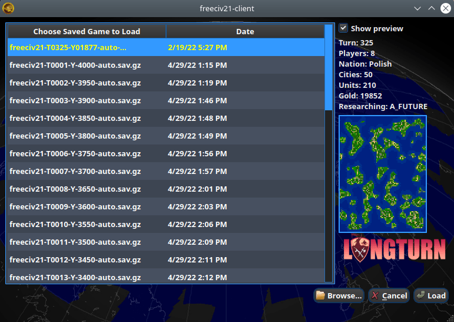

    Figure 6: Load Saved Game Dialog

Freeciv21 will show you a sample of the game map and some information about the game. If this is not what you
were looking for, select another save from the table. When you have found the save you want to load, click on
the :guilabel:`Load` button and you will be placed in the game at the save point.

Alternately, you can click on the :guilabel:`Browse` button to browse your local filesystem to pick a saved
game that is not in your user profile.

Start Scenario Game
-------------------

When you click on the :guilabel:`Start Scenario Game` button, a dialog box will appear as in Figure 7 below.
You can click on a scenario to select it and see information about the selected scenario on the panel to the
right side. When you have found the scenario you want to run, click on the :guilabel:`Load Scenario` button.
This will bring up the new game dialog as shown in Figure 2 above. When ready, click :guilabel:`Start` to
begin the scenario game.

.. figure:: ../../_static/images/gui-elements/scenarios.png
    :height: 400px
    :align: center
    :alt: Freeciv21 Scenarios Dialog
    :figclass: align-center

    Figure 7: Scenarios Dialog

.. Tip:: If you are new to Freeciv21, the ``tutorial`` scenario will walk you through about 100 turns worth
  of tips on how to get started playing a single-player game.

Clicking on the :guilabel:`Browse` button will bring a filesystem browser that you can use to pick a
scenario file in an alternate location. Clicking on :guilabel:`Cancel` will bring you back to the
`Launching the client`_ start screen.

Options
-------

When you click on the :guilabel:`Options` button, a dialog box will appear as in Figure 8 below. This dialog
allows you to set a myriad of options that effect the look at feel of the client when you are playing a game.

The local client options dialog box can also be opened while in a game via the
:menuselection:`Game --> Local Options` menu.

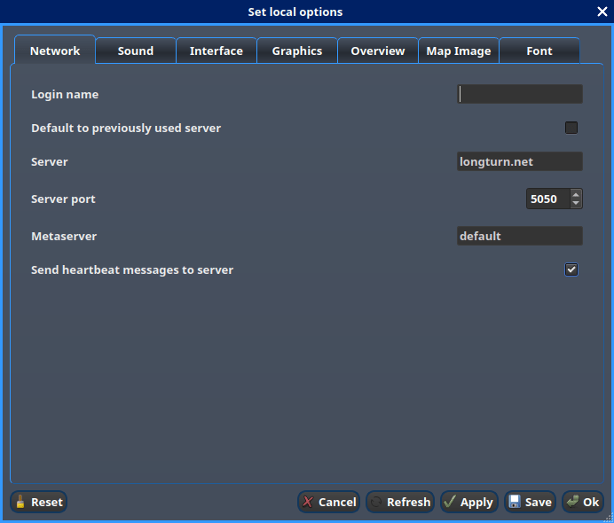

    Figure 8: Local Options Dialog

The local options dialog is broken down into the following tabs:

* :guilabel:`Network`: On this tab you can save your preferred username, server and port information to be
  used during `Connect to Network Game`_.
* :guilabel:`Sound`: On this tab you can set everything related to in game sound and music.
* :guilabel:`Interface`: On this tab you can set anything related to how you interact with the interface of
  client while playing a game.
* :guilabel:`Graphics`: On this tab you can change the look and feel with a different theme. NightStalker is
  the default theme out of the box. You can also set the default tileset to use under different map styles as
  well as various things you may or may not want the client to paint (draw) on the screen.
* :guilabel:`Overview`: On this tab you can enable/disable varying layers of the map.
* :guilabel:`Map Image`: The Freeciv21 client allows you to save images of the map to the filesystem. This
  tab allows you to configure how you want to do that. Refer to `Game Menu`_ for more information.
* :guilabel:`Font`: There are a collection of font styles used in the client. This tab allows you to tailor
  them to your own favorites.

The buttons along the bottom of the dialog box are:

* :guilabel:`Reset`: Clicking this button will reset all the options to the out of box defaults.
* :guilabel:`Cancel`: Clicking this button will either return you to the `Launching the client`_ start screen
  or close the dialog and drop you back to the `Map View`_ if requested from the :guilabel:`Game` menu.
* :guilabel:`Refresh`: If you used the modpack installer to add a new tileset, soundset, or musicset with the
  local options dialog open, you can use the :guilabel:`Refresh` button to reload the available choices for
  some of the drop down selection boxes.
* :guilabel:`Apply`: Apply the settings as set to the client for immediate effect. This button won't do much
  if local options was called from the `Start New Game`_ dialog box.
* :guilabel:`Save`: Save the current settings to the freeciv21 client resource (``rc``) file on the local
  filesystem.
* :guilabel:`OK`: Apply the settings and close the dialog box. This button does not do a save operation by
  default.

Main Client Interface
=====================

Regardless the method you used to get into a game, eventually you will make it to the main client interface as
shown in Figure 9 below. This is known as the `Map View`_.

.. figure:: ../../../dist/freeciv-screenshot-2048x1112.png
    :height: 400px
    :align: center
    :alt: Freeciv21 Client Overview
    :figclass: align-center

    Figure 9: Freeciv21 Client Overview

The client interface is broken down into a collection of sections. From the top, the sections are:

* :strong:`Menu Bar`: As with most programs, Freeciv21 is no different and has a menu bar at the top. For
  details see `Menu Bar`_.
* :strong:`Top Function Bar`: This top bar is a big aspect of playing any Freeciv21 game. More details are
  available in the `Top Function Bar`_ section.
* :strong:`The Main Map`: This is the main canvas of the game. This is where your empire will either thrive
  or be destroyed by your enemies. Refer to `Map View`_ for more information.
* :strong:`Unit Controls`: Figure 9 shows a :unit:`Battleship` selected and the available unit actions in a
  bar at the bottom middle of the interface. This is the `Unit Controls`_ bar.
* :strong:`Mini Map`: In the lower-right corner of the main map interface is a small version of the map known
  as the `Mini Map`_.

Menu Bar
--------

Freeciv21 is no different than any other multi-function complex program -- it has a menu bar. The menu
consists of the following items:

* `Game Menu`_
* `View Menu`_
* `Select Menu`_
* `Unit Menu`_
* `Combat Menu`_
* `Work Menu`_
* `Multiplayer Menu`_
* `Civilization Menu`_
* `Help Menu`_

Game Menu
^^^^^^^^^

The :guilabel:`Game` menu is used to conduct global level options on the client or the game being played.

The :guilabel:`Game` menu has the following options:

Save Game
    Saves the game as it is :strong:`right now` to the ``saves`` directory in the user's profile directory.
    On Linux and Mac OS, the profile directory is inside the User's home directory such as
    ``~/.local/share/freeciv21``. On Windows the profile directory is inside the User ``AppData`` directory
    such as ``C:\\Users\\<userName>\\AppData\\Roaming\\freeciv21``.

Save Game As ...
    Saves the game as it is :strong:`right now` to a location of your choosing.

Save Map to Image
    Save a ``.png`` image file of the map to the user's profile directory.

Set Local Options
    Opens the :guilabel:`Local Options` dialog box as described in the `Options`_ section above.

Server Options
    Opens the :guilabel:`Server Options` dialog as described in the `More Game Options`_ section
    above.

Messages
    Opens the :guilabel:`Message Options` dialog as shown in Figure 10 below. The screenshot only shows a few
    rows of available options, many more will be found in the client. Any item with a check mark in the
    :guilabel:`Out` column will be shown in the :guilabel:`Server Log/Chat` widget. Any item with a check mark
    in the :guilabel:`Mes` column will be shown in the :guilabel:`Messages` widget (see `Messages`_). Lastly,
    any item with a check mark in the :guilabel:`Pop` column will be shown in a Pop-Up Message Box window.

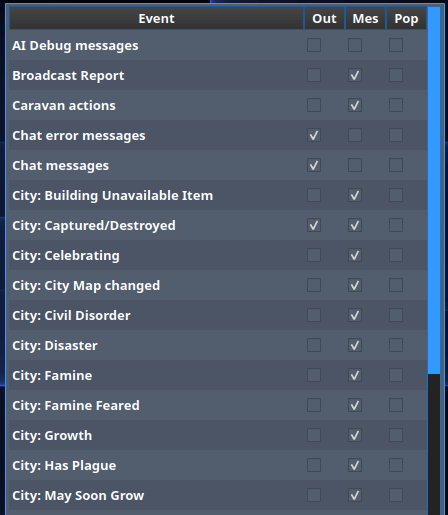

  Figure 10: Message Options Dialog

Shortcuts
    Opens the :guilabel:`Shortcuts` dialog as shown in Figure 11 below. The dialog is used to set the
    preferred keyboard shortcuts to be used in the game. The screenshot only shows a few rows of available
    options, many more will be found in the client. To override the default, click your mouse cursor on the
    box on the right and then "use" the shortcut you want to set the setting to. For example: You want to
    change the :guilabel:`Scroll Map` option to the :guilabel:`PgUp` key, you would click in the box and then
    press the :guilabel:`PgUp` key on your keyboard. To reset to defaults, you can click on the
    :guilabel:`Reset` button. Click :guilabel:`Save` and then :guilabel:`Close` when finished.

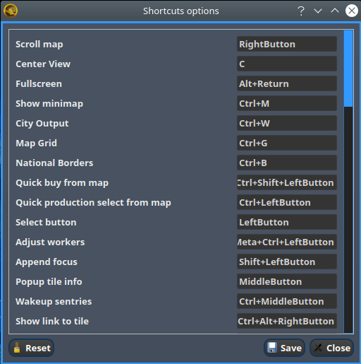

  Figure 11: Shortcut Options Dialog

Load Another Tileset
    Opens the :guilabel:`Available Tilesets` dialog as shown in Figure 12 below. You can select any tileset
    installed by clicking on the name. You may get an error message if the tileset is not compatible with
    the server map topology configuration.

.. figure:: ../../_static/images/gui-elements/tileset.png
  :align: center
  :alt: Freeciv21 Available Tilesets Dialog
  :figclass: align-center

  Figure 12: Available Tilesets Dialog

Tileset Debugger
    Opens the :guilabel:`Tileset Debugger` dialog. This option is well documented in
    :doc:`../../Modding/Tilesets/debugger`

Save Options Now
    Saves the settings set in `Options`_ immeditately.

Save Options on Exit
    Saves the settings set in `Options`_ when the client is exited.

Leave Game
    Allows you to leave the game and return to the start screen.

Quit
    Quits the client after a confirmation dialog box.

View Menu
^^^^^^^^^

The :guilabel:`View` enables a user to manipulate what is shown on the `Map View`_ as well as varying degrees
of zooming in and out.

The :guilabel:`View` menu has the following options:

Center View
    With a unit selected, this menu option will place the unit in the center of the screen.

Fullscreen
    Sets Freeciv21 to use the whole screen, removing the title bar and operating system Task bar.

Minimap
    Shows or hides the `Mini Map`_ in the lower right corner.

Show New Turn Information
    Enables or Disables populating new turn information into the `Messages`_ widget.

Show Detailed Combat Information
    Enables or Disables populating detailed combat information into the `Messages`_ widget. Detailed combat
    information looks like this:

.. code-block:: rst

    Your {veteran level} {unit name} [id:{number} D:{defense} HP:{hit points}] lost to an
    attack by the {enemy nation} {veteran level} {unit name} [id:{number} A:{attack} lost
    {number} HP, has {number} HP remaining and achieved the rank of {veteran level}].

Lock Interface
    Locks the user interface, preventing the move of objects around such as the server log/chat widget.

Zoom In
    Each selection of this menu option (or corresponding keyboard shortcut or user interface icon next to the
    `Mini Map`_) will zoom in on the `Map View`_ one level.

Zoom Default
    Resets the zoom level to the defaul position at Zoom Level 0.

Zoom Out
    Each selection of this menu option (or corresponding keyboard shortcut or user interface icon next to the
    `Mini Map`_) will zoom out on the `Map View`_ one level.

Scale Fonts
    Enables fonts to scale along with the zoom level.

Citybar Style
    This menu has a sub-menu of three options: :guilabel:`Simple`, :guilabel:`Traditional`, and
    :guilabel:`Polished` as shown in Figures 13, 14 and 15 respectfully.

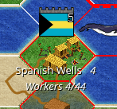

  Figure 13: Citybar style - Simple

.. figure:: ../../_static/images/gui-elements/citybar-traditional.png
  :align: center
  :alt: Citybar style - Traditional
  :figclass: align-center

  Figure 14: Citybar style - Traditional

.. figure:: ../../_static/images/gui-elements/citybar-polished.png
  :align: center
  :alt: Citybar style - Polished
  :figclass: align-center

  Figure 15: Citybar style - Polished

City Outlines
    Enables or Disables the disply on the `Map View`_ of the city's vision radius or outline.

City Output
    Enables or Disables the display on the `Map View`_ the city's food, production and trade as shown
    in the `City Dialog`_ box.

Map Grid
    Enables or Disables the display on the `Map View`_ the tile grid. This can be useful to help differentiate
    individual tiles from others.

National Borders
    Enables or Disables the display on the `Map View`_ the national borders of your neighbors. Each nation is
    given a color at game start (as seen on the `Nations and Diplomacy View`_).

Native Tiles
    Enables or Disables the display on the `Map View`_ tiles that are native to the unit selected. Non-native
    tiles are marked with a red hash. Non-Native means that the unit cannot move there.

City Names
    Enables or Disables the display on the `Map View`_ the names of cities in the city bar.

City Growth
    Enables or Disables the display on the `Map View`_ the growth of cities in the city bar.

City Production Levels
    Enables or Disables the display on the `Map View`_ the production of cities in the city bar.

City Buy Cost
    Enables or Disables the display on the `Map View`_ the cost to buy the currently constructed item in the
    city bar.

City Traderoutes
    Enables or Disables the display on the `Map View`_ trade routes between cities.

Select Menu
^^^^^^^^^^^

The :guilabel:`Select` is used to select units on the game map in varying degrees.

The :guilabel:`Select` menu has the following options:

Single Unit (Unselect Others)
    Assuming you have selected multiple units (such as the next menu for :guilabel:`All on Tile`) and you want
    to quickly undo that. This menu supports that function.

All on Tile
    Quickly select all of the units on the same tile. This assumes that multiple units of different type are
    stacked on the same tile.

Same Type on Tile
    Quickly select all of the units of the same type on the tile. This assumes that multiple units of
    different types are stacked on the same tile.

Same Type on Continent
    Works the exact same way as the menu option above (:guilabel:`Same Type on Tile`) but expands the
    selection to the same island or continent.

Same Type Everywhere
    Even larger window of unit selection to pick all of the same type, but in all locations across the
    `Map View`_. This is useful to help you find units placed in allied cities or to conduct a mass
    airlift.

Wait
    If you are not ready to move the currently selected unit, you can tell it to :strong:`wait` with this menu
    option. The rotation of unit selection will bypass this unit and will come back until you either
    move the unit or tell it your are done.

Done
    If you have moved the unit, but still have move points left or are simply done working with the unit for
    you can tell the client you are finished (done) with it with this menu item.

Advanced Unit Selection
    Opens the :guilabel:`Advanced Unit Selection` dialog box as shown in Figure 16 below. This dialog box
    gives you options to select a group of units using a more nuanced grouping method other than the other
    :guilabel:`Select` menu options.

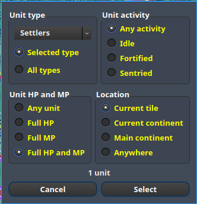

  Figure 16: Advanced Unit Selection Dialog

Unit Menu
^^^^^^^^^

The :guilabel:`Unit` menu is used to give units orders.

The :guilabel:`Unit` menu has the following options:

Go to Tile
    With a unit selected, give the unit orders to go to a selected tile on the map.

Go to and...
    Similar to :guilabel:`Go to Tile` above, however when the unit reaches the given tile you can give the
    unit a specific command to do as selected from the sub-menu. This is useful, for example, for
    :unit:`Settler` units to have them go to a spot and build a city as soon as possible.

Go to Nearest City
    Instruct the unit to go to the nearest city. Nearest in this context is the one that can be reached in
    the fewest move points (MPs).

Go to/Airlift to City...
    If Airlifting is enabled in the game (and assuming you have any required city improvement(s) that are
    required for Airlifting), you use this menu to tell the unit to transport to a city with the Airlift
    capability. A dialog box will pop up asking what city you want to Airlift to.

.. tip:: Depending on the setup of the rules, a player could use the :guilabel:`Select` menu to select many
  units of a similar type and then use this menu item to Airlift a great number of units all in one move
  very quickly.

Autoexplore
    Ask the unit to automatically open up the unknown (the area of the map that is black and has not been
    visited by any of your units).

Patrol
    Instruct a unit to make a collection of moves in a pattern as part of a patrol route.

Sentry
    Asks a unit to :strong:`Sentry`. Senty is not the same as :strong:`Fortify` as found in the
    :guilabel:`Combat` menu. A sentried unit is on lookout and will give notice if another unit from an
    opponent comes into its field of vision.

.. note:: A sentried unit does not gain a fortification bonus when outside of a city. However, sentried
  units inside of cities gain a default fortification bonus while in the city.

Unsentry All On Tile
    Instruct a stacked set of units on a single tile to stop that activity and ask for new orders.

Load
    Load a unit into a transporter, such as a :unit:`Caravel`, :unit:`Galleon`, or :unit:`Transport` ship.

Unload
    Unload a unit from a transporter.

Unload All From Transporter
    If you have many units inside of a transporter and you want all of them to disembark at the same time,
    then you can use this menu to make that nice and easy.

Set Home City
    Transfers ownership and management (e.g. support) of a unit to the city that it is currently present in.
    This menu allows you to shift support of units around to help with the cost of supporting units. Refer to
    `Economics View`_ for more information on unit support costs.

Upgrade
    Upgrade a unit from one level to another. For example, :unit:`Phalanx` units are often upgradeable to an
    improved :unit:`Pikemen` with the discovery of :strong:`Feudalism`. The upgrade will cost gold and the
    client will tell you what that cost is before you agree to the spend.

Convert
    Similar to :guilabel:`Upgrade`. The convert option allow you to change a unit from one type to another.
    This is ruleset dependent and is not available in all rulesets.

Disband
    Use this menu option to eliminate (kill, destroy, fire) a unit. If done inside of a city, then 50% of
    the shields used in the production of the unit is given to the city and helps build whatever is currently
    under construction. If a unit is disanded outside of a city, there is no benefit other than the
    elimination of shield or gold upkeep depending on your form of government.

Rename
    Give the unit a unit name. Similar to many Naval vessels in real life, you can name your units with a
    special name.

Combat Menu
^^^^^^^^^^^

The :guilabel:`Combat` menu is used to give combat units orders.

The :guilabel:`Combat` menu has the following options:

Fortify Unit
    Instruct the unit to :strong:`Fortify` on the tile. An icon will show on the unit signifying
    fortification. By fortifying, the unit is given a defensive bonus depending on the terrain it is on. See
    in game help for more specifics of what defense bonuses are given by terrain type. When a unit is
    fortifying, it is not in :strong:`Sentry` mode and will not inform you of enemy unit movement inside of
    its vision radius.

Build Fortress/Bouy
    Some units have the ability to build forts, fortresses, and bouys. They are typically :unit:`Workers` or
    :unit:`Engineers`. In some rulesets, :unit:`Transports` can build Bouys. Forts, Pre-Forts and Fortresses
    give a unit increased defensive bonuses in addition to what is provided by the base terrain. See in
    game help for the specifics. Bouys are used to act as sentries in the oceans around your cities and can
    give you opponent unit movement information.

Build Airbase
    Instructs a unit to build an Airbase. This is often a requirement for Airlifting in many rulesets. They
    also often give the ability to heal an aircraft type unit faster while on the tile.

Build Base
    This generic menu will include a sub-menu of all of the base type tile improvements that can be built
    as defined by the current ruleset.

Pillage
    Tells a unit to remove (pillage) tile infrastructure improvements such as roads, railroad and bases.

Do...
    A dialog box will pop up here and give you all of the actions that the unit selected can perform.

Work Menu
^^^^^^^^^

The :guilabel:`Work` menu is used to give units infrastructure work orders such as building roads, irrigation,
or mines. Tile infrastructure improvements are mostly done with :unit:`Workers` and :unit:`Engineers`, however
some rulesets allow other units to perform this type of work. See in game help for details.

The :guilabel:`Work` menu has the following options:

Build City
    Certain units such as :unit:`Settlers` can found cities. If the unit has sufficient move points available,
    then giving this command will build a new city where the unit is currently placed on the `Map View`_. The
    unit will be consumed by the action.

Auto Worker
    Tell a :unit:`Worker` to use an in game algorithm to improve tiles. The game engine will give the
    :unit:`Worker` instructions so you don't have to.

Build Road/Railroad/Maglev
    Tell a :unit:`Worker` to build a road. If sufficient technological knowledge is available, then a railroad
    and eventually a maglev may be able to be constructed at a later time during the game. The menu will
    change with the best available option depending on what has been done to improve the tile in the past.

Build Path
    Provides a sub-menu of all of the pathing options available for the tile. This is mostly road, railroad,
    and maglev. Other rulesets may other different path types. See in game help for more details.

Build Irrigation/Farmland
    Tell a :unit:`Worker` to irrigate the tile in order to improve the food output from the tile. If
    sufficient technological knowledge is available, then a farmland may be added to the tile at a later
    time during the game. The menu will change with the best available option depending on what has been
    done to improve the tile in the past.

Cultivate to Plains
    Cultivation is a multi-step process where a tile is converted from one type to another. Such as converting
    a swamp to plains. Not all tile terrain types can be cultivated to other types. See in game help for
    details.

Build Mine
    Tells a :unit:`Worker` to build a mine on a tile to improve the shield output.

Plant Forest/Swamp
    If the unit is on a grassland tile, then you can tell the :unit:`Worker` to plant a forest on the tile. If
    the unit is on a forest tile, then you can tell the :unit:`Worker` to convert the forest to swamp.

Connect with Road
    Tell a :unit:`Worker` to build a road many times along a given path.

Connect with Railroad/Maglev
    Tell a :unit:`Worker` to build a railroad or maglev many times along a given path.

Connect with Irrigation
    Tell a :unit:`Worker` to connect many tiles together with irrigation. This is often done to get
    irrigation from a source of fresh water over to a city.

Transform to Hills/Swamp/Ocean
    Tell a :unit:`Engineer` to conduct a major terraforming operation on the tile. Mountains can be cut down
    to hills, forests and grassland can be converted to swamp and then the swamp can be converted to ocean.
    In some circumstances, ocean can be converted to swamp and then the swamp can be converted to grassland.
    In most rulesets, only the :unit:`Engineer` unit can do these major operations.

Clean Pollution
    Tell a :unit:`Worker` to clean pollution from the tile. Pollution on a tile will eliminate or severely
    cripple the output of a tile and contributes to global warming.

Clean Nuclear Fallout
    If a :unit:`Nuclear` unit has been detonated nearby (e.g. attacked a city), then there will be nuclear
    fallout all over the place. Similar to pollution, nuclear fallout severely cripples the output of a tile
    and contributes to nuclear winter.

Help Build Wonder
    Certain units, such as :unit:`Caravan` can be used to move production from one city to another and help
    build Small and Great Wonders. This menu aids that function. Alternately you can simply "walk the
    :unit:`Caravan` into a city and a pop up dialog will ask what you want to do.

Establish Trade Route
    Certain units, such as :unit:`Caravan` can be used to establish a trade route between two cities. This
    menu aids that function.

As you can see, there are a number of ways that a tile can be altered with infrastructure improvements. Be
sure to have a close look at the in game help on Terrain for more information.

Multiplayer Menu
^^^^^^^^^^^^^^^^

The :guilabel:`Multiplayer` menu has a collection of functions to aid certain multi-player games. Many of
the options are specifically tailored to the MP2c and WarCiv rulesets.

The :guilabel:`Multiplayer` menu has the following options:

Delayed GoTo
    Give a unit orders to move at a specific time in the turn. This assumes that the turn is time based.

Delayed Orders Execute
    Execute an action by a unit at a specific time in the turn. This assumes that the turn is time based.

Clear Orders
    Clear any delayed orders from the above two menu items.

Add All Cities to Trade Planning
    All all current cities in your into an advanced trade planning array. This is used by the WarCiv
    ruleset.

Calculate Trade Planning
    Run a trade effectiveness algorithm across all of the cities in the trade plan to determine the best
    routes. This is used by the WarCiv ruleset.

Add/Remove City
    Add or remove a city from the trade planning array.

Clear Trade Planning
    Clear all trade planning to start over.

Automatic Caravan
    Any :unit:`Caravan` units built by a city will follow the trade planning output for that city. This is
    used by the WarCiv ruleset.

Set/Unset Rally Point
    Set or remove a rally point to easily send units, once produced, to a specific spot on the game map.

Quick Airlift
    Depending on what is selected in the menu below, you can quickly airlift a unit to a destination city.

Unit Type for Quickairlifting
    Select the type of unit that will be quick airlifted by the menu above.

Default Action vs Unit
    A sub-menu will show some optional actions that a unit should do by default against another unit.
    The default is :strong:`Ask`.

Default Action vs City
    A sub-menu will show some optional actions that a unit should do by default against a city.
    The default is :strong:`Ask`.

Civilization Menu
^^^^^^^^^^^^^^^^^

The :guilabel:`Civilization` menu is used to gain access to many fuctions of your empire. You can load up
pages for units, cities, nations, etc; change the form of government and see how your are doing compared to
your opponents with the demographics report.

The :guilabel:`Civilization` menu has the following options:

Tax Rates
    Selecting this menu item will bring up a dialog box allowing you to set the rate in percentage points for
    Gold (Taxex), Science (Bulbs), and Luxury (Goods). This is the same as clicking on the `Tax Rates View`_
    option on the `Top Function Bar`_. Figure 17 below, shows a sample screenshot. In this example, the
    player's nation is in Democracy and has set gold to 40%, science to 40% and luxury goods to 20%.

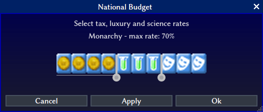

  Figure 17: Tax Rates Selection Dialog

Government
    Depending on your technological progress through the game, you may be able to select a different form
    of government. The change is achieved from this menu item. This is the same as clicking on the
    `National Status View`_ option on the `Top Function Bar`_.

View
    Clicking this menu item will show you the main game map. This is the same as clicking on the
    `Map View`_ option on the `Top Function Bar`_.

Units
    Clicking this menu item will show you the units report widget. This is the same as clicking on the
    `Units View`_ option on the `Top Function Bar`_.

Players
    Clicking this menu item will show you the nations and diplomacy view. This is the same as clicking on the
    `Nations and Diplomacy View`_ option on the `Top Function Bar`_.

Cities
    Clicking this menu item will show you the cities view. This is the same as clicking on the
    `Cities View`_ option on the `Top Function Bar`_.

Economy
    Clicking this menu item will show you the Ecomonics view. This is the same as clicking on the
    `Economics View`_ option on the `Top Function Bar`_.

Research
    Clicking this menu item will show you the research tree view. This is the same as clicking on the
    `Research View`_ option on the `Top Function Bar`_.

Wonders of the World
    Clicking this menu item will show you a traveler's report widget on the `Map View`_. The widget will give
    information on any cities that have constructed any of the Great Wonders.

.. figure:: ../../_static/images/gui-elements/wonders.png
  :align: center
  :alt: Freeciv21 Wonders of the World
  :figclass: align-center

  Figure 18: Wonders of the World

Top Five Cities
    Clicking this menu item will show you a traveler's report widget on the `Map View`_. The widget will give
    information on the top five largest cities.

.. figure:: ../../_static/images/gui-elements/top-five-cities.png
  :align: center
  :width: 400px
  :alt: Freeciv21 Top Five Cities
  :figclass: align-center

  Figure 19: Top Five Cities

Demographics
    Clicking this menu item will show you a demographics report widget on the `Map View`_. The widget will
    give information about how your nation stacks up against your opponents. If you have an embassy with your
    opponents in the game, the demographics report will tell you who is #1, if you are not #1.

.. figure:: ../../_static/images/gui-elements/demographics.png
  :align: center
  :width: 400px
  :alt: Freeciv21 Demographics
  :figclass: align-center

  Figure 20: Demographics

Space Ship
    Clicking this menu item will show you the space ship view. The space race is a ruleset defined option and
    is not enabled in all rulesets. Your nation must also be very technologically advanced to build the
    components needs for a space ship. See in game help for more details.

    The client will automatically place the components for you as you construct them.

Achievements
    Clicking this menu item will show you an achievements report widget on the main map. Achievements are
    a ruleset defined option and not enabled by default in many rulesets.

.. figure:: ../../_static/images/gui-elements/achievements.png
  :align: center
  :alt: Freeciv21 Achievements
  :figclass: align-center

  Figure 21: Achievements

Help Menu
^^^^^^^^^

The :guilabel:`Help` menu gives you access to the in-game help.

The :guilabel:`Help` menu has the following options: Overview, Strategy and Tactics, Terrain, Ecomony, Cities,
City Improvements, Wonders of the World, Units, Combat, Zones of Control, Government, Effects, Diplomacy,
Technology, Space Race, About Current Ruleset, About Nations, Connecting, Controls, Citizen Governor,
Chatline, Worklist Editor, Languages, Copying, and About Freeciv21

Each of these options is simply a quick link to the same named section in the game help menu.

Top Function Bar
----------------

The :guilabel:`Top Function Bar` is used to get to varying views (pages) in the game without having to us the
main menu, especially the :guilabel:`Civilization` menu.  The :guilabel:`Top Function Bar` is broken up into 9
sections, from left to right.

* `Map View`_
* `Units View`_
* `Cities View`_
* `Nations and Diplomacy View`_
* `Research View`_
* `Economics View`_
* `Tax Rates View`_
* `National Status View`_
* `Messages`_

Map View
^^^^^^^^

This is your primary playing surface. This is the map where you build your civilization. The icon for this is
shown in Figure 22 below. Figure 9, in the `Main Client Interface`_ section, has a good example of the
:guilabel:`Map View`.

  Figure 22: Map View Icon

If you hover your mouse over the :guilabel:`Map View` icon, a pop up widget will appear and give you some
information about your nation. The pop up widget shows: Nationality, Total Population, Year (Turn Number),
Gold (Surplus/Deficit), and Tax Rates.

To move around the map canvas, you can right-click in the main map area and the canvas will move. The further
from the center of the screen, the faster the map canvas will move per mouse click.

One other feature of the :guilabel:`Map View` is the ability to middle-click on a unit and a pop-up widget
will appear giving you some information about the unit. Figure 23, gives an example.

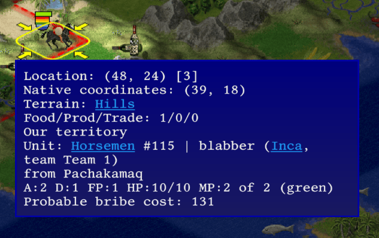

  Figure 23: Map View - Unit Information

Units View
^^^^^^^^^^

The :guilabel:`Units View` is a widget on the `Map View`_ that shows what units you have available and how
many are being produced. The `Cities View`_ can tell you which cities are producing what unit. Figure 24 shows
the icon to bring up the widget. Clicking the icon a second time will close the widget.

.. figure:: ../../_static/images/gui-elements/top-bar-units.png
  :align: center
  :alt: Freeciv21 Units
  :figclass: align-center

  Figure 24: Units View Icon

The :guilabel:`Units View` has two types. For regular games without the ``unitwaittime`` server setting set,
you get something simiar to Figure 25. If you are playing a game with ``unitwaittime`` set, then you will see
a table below the widget, such as Figure 26, that displays the amount of time until the unit can move.

.. figure:: ../../_static/images/gui-elements/units-report.png
  :align: center
  :width: 800px
  :alt: Freeciv21 Units Report
  :figclass: align-center

  Figure 25: Units View

.. figure:: ../../_static/images/gui-elements/units-report-uwt.png
  :align: center
  :width: 400px
  :alt: Freeciv21 Units Report w/ UWT
  :figclass: align-center

  Figure 26: Units View with UWT

Cities View
^^^^^^^^^^^

The :guilabel:`Cities View` is a separate page in a table format. When you click the icon for it as shown in
Figure 27, the client will leave the view you are currently showing and will switch to a listing of your
cities.

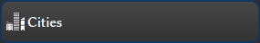

  Figure 27: Cities View Icon

Figure 28 gives a sample of the :guilabel:`City View` in the client with the default columns displayed. If
you right-click on the table heading, you will be given a list of other columns you may want to show. If you
change anything, then be sure to save the settings from the :guilabel:`Game` menu.

.. figure:: ../../_static/images/gui-elements/cities.png
  :align: center
  :alt: Freeciv21 Cities
  :figclass: align-center

  Figure 28: Cities

If you double-click on a city row, the game will switch to the `Map View`_ and open the `City Dialog`_. When
you close the `City Dialog`_, the client will not bring you back to the :guilabel:`City View`. You will need
to do that yourself. If you right-click on a city's row, a pop-up menu will appear. From this menu you can
change what the city is producing, set a city govenor, sell a city improvement, conduct an advanced selection
of cities, buy what is currently being produced, and center the city on the map. If you choose to center the
city on the map, the client will close the :guilabel:`Cities View` and open the `Map View`_ and place the city
in the center of the screen.

Nations and Diplomacy View
^^^^^^^^^^^^^^^^^^^^^^^^^^

The :guilabel:`Nations and Diplomacy View` is actually two views accessed from the same place on the `Top
Function Bar`_. When you click the icon for it as shown in Figure 29, the client will leave the view you are
currently showing and display a list of nations that you are playing against in a table format.

  Figure 29: Nations and Diplomacy View Icon

Figure 30 gives a sample of the :guilabel:`Nations View` in the client with the all available columns
displayed. If you right-click on the table heading, you will be given a list of column names that you can
enable or disable. If you change anything, then be sure to save the settings from the :guilabel:`Game` menu.

.. figure:: ../../_static/images/gui-elements/nations.png
  :align: center
  :width: 800px
  :alt: Freeciv21 Nations View
  :figclass: align-center

  Figure 30: Nations View

If you have an embassy with a nation you will be able to see much more in the table than if you do not have an
embassy. Also, if you click (select) the row of a nation you have an embassy with, you will be given some
interesting intelligence at the bottom of the page. Figure 31 gives an example.

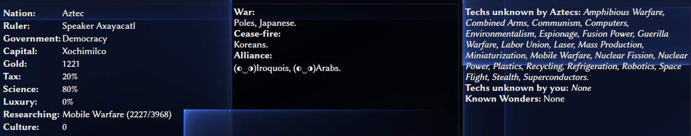

  Figure 31: Nations Intelligence

On the left you will see the name of the Nation; The name (username) of the Ruler; the current form of
Government; the Capital city; how much Gold they have in the bank; the tax rates, research target; and culture
score.

.. note:: The Capital City will show as ``unknown`` if you have not seen the city on the `Map View`_. If it is
  in the unknown or has not been seen by one of your units, then you will not have knowledge of the Capital.

In the center you can see the relationship status of the nation across the game. If you see a half-moon icon
next to a nation, then the nation selected has given shared vision to that nation. In Figure 30 above, you can
see that the Aztecs have an alliance with the Iroquois and the Arabs. The Aztecs also have shared vision with
both of these nations.

On the right, you can see a comparison of technological research between your nation and the nation selected.

The :guilabel:`Nations and Diplomacy View` has a few buttons at the upper-left. From left to right, they are:
:guilabel:`Meet`, :guilabel:`Cancel Treaty`, :guilabel:`Withdraw Vision`, and :guilabel:`Toggle AI Mode`. This
is how you access the :guilabel:`Diplomacy` component of the :guilabel:`Nations and Diplomacy View`.

Let's talk about the buttons from right to left as :guilabel:`Meet` takes the longest to describe. Depending
on the command line level you have in the game (defaul is ``hack`` for single player games), you may be able
to change a player from an AI to a human after a game has started to allow a human player to come into the
game. This is what the :guilabel:`Toggle AI Mode` button does. If the button is greyed-out you cannot change
the AI mode in the game.

If you have previously shared vision via a treaty from the :guilabel:`Diplomacy View`, you can revoke it by
clicking on the :guilabel:`Withdraw Vision` button. Sharing vision is similar to you allowing another player
to see all of your territory.

If you have a relationship with a player other than :strong:`War`, you can cancel it with the
:guilabel:`Cancel Treaty` button. Relationship pacts can be changed with the :guilabel:`Diplomacy View`. Most
rulesets support :strong:`Cease Fire`, :strong:`Peace`, and :strong:`Alliance`.

.. note:: Some forms of government won't allow you to break a :strong:`Peace` or :strong:`Alliance` treaty
  without going to into Anarchy.

Lastly, clicking :guilabel:`Meet` will bring up a diplomacy screen where you can interact with a player that
you have an embassy with. Figure 32, shows a sample screen where the parties are agreeing to a cease fire.

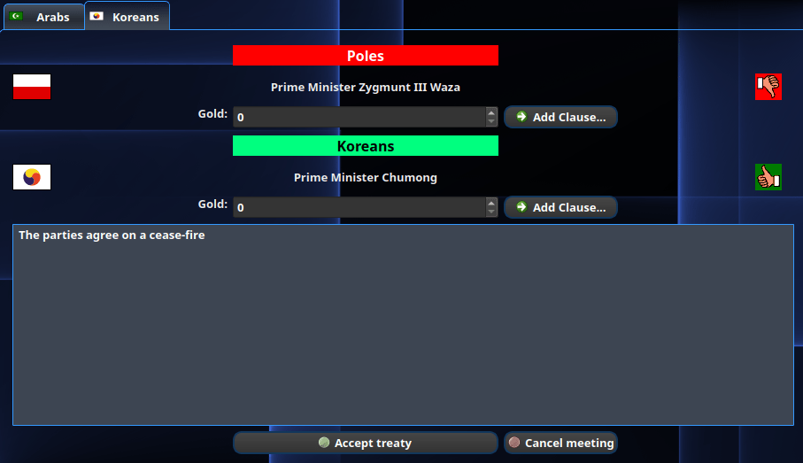

  Figure 32: Diplomacy

If you wish to give gold to a player, enter in the amount in the :guilabel:`Gold` box. You can also add
clauses to the treaty by selecting from the :guilabel:`Add Clause` button. Depending on what is enabled in
your game, you can swap sea and world maps, trade cities, give advances, share vision, give an embassy, or
agree to peace or an alliance via a pact. If you are happy with the components of the treaty you can click the
:guilabel:`Accept Treaty` button. The client will change the thumbs-down icon to the right of your nation to a
thumbs-up showing agreement. If you don't want to do anything and definitely do not want to accept the treaty,
then you can click on the :guilabel:`Cancel Meeting` button. This will close the :guilabel:`Diplomacy View`
and return you to the :guilabel:`Nations View`.

.. note:: The ability to trade maps, cities, or advances is ruleset dependent and may not be enabled for all
  games. The other clauses such as share vision, give an embassy or change the relationship via a pact are
  enabled at all times.

.. tip:: You don't have to use the :guilabel:`Diplomacy View` to get an embassy with a player. You can always
  build a :unit:`Diplomat` unit and have that unit get an embassy by going to a player's city and "walk" into
  the city. An action dialog will show and you can establish an embassy without asking via diplomacy. See in
  game help for more information on using units to conduct many gameplay features besides simply establishing
  an embassy.

Lastly, you can see in Figure 32 above that there are more than one conversations occuring. Your foreign state
deparment is busy! If you happen to click out of the :guilabel:`Diplomacy View`, for example by clicking on
the icon for the `Map View`_, the icon for the :guilabel:`Nations and Diplomacy View` will change from what is
shown in Figure 29 and instead will change to what is shown in Figure 33 below.

.. figure:: ../../_static/images/gui-elements/top-bar-nations-diplomacy.png
  :align: center
  :alt: Freeciv21 Nations w/ Diplomacy Open
  :figclass: align-center

  Figure 33: Nations and Diplomacy View Icon w/ Diplomacy View Open

To quickly access the :guilabel:`Diplomacy View`, you can right-click on the icon to bring it up. A normal
left-click of the icon will bring up the :guilabel:`Nations View` as shown in Figure 30 above.

Research View
^^^^^^^^^^^^^

The :guilabel:`Research View` is a separate page showing the technology research tree. This is the page
where you instruct your scientists to research technologies. When you click the icon for it as shown
in Figure 34, the client will leave the view you are currently showing and will switch to a listing of your
research tree.

.. figure:: ../../_static/images/gui-elements/top-bar-research.png
  :align: center
  :alt: Freeciv21 Research
  :figclass: align-center

  Figure 34: Research View Icon

If you hover your mouse over the icon, a pop up widget will appear and give you some information about your
nation's research.

Figure 35 below shows a sample of a :guilabel:`Research Tree`. In this picture the player has actually
finished all of the available technologies (known as completing the research tree) and is simply researching
"future" technologies.

.. figure:: ../../_static/images/gui-elements/research-tree.png
  :align: center
  :width: 800px
  :alt: Freeciv21 Research Tree
  :figclass: align-center

  Figure 35: Research Tree

If nothing is being researched, the :guilabel:`Research View` icon will flash to bring attention to it.

On the :guilabel:`Research Tree`, the top-left drop down box is where you can pick from a menu of what
technology you want your scientists to concentrate on. The bottom-left drop down box is where you can set a
longer range target. The client will work through the list of technologies as turns progress in order of
dependency. The progress bar on the right will show you how many bulbs you are producing each turn, how many
more bulbs you have left to finish the research target and if enabled, how many bulbs are being used for
technology upkeep.

If you do not want to use the drop down boxes to pick current and target technologies, you can left-click on
the box for the technology in the :guilabel:`Research Tree` view.

If you hover your mouse over the icons in the :guilabel:`Research Tree`, a pop-up widget will appear giving
you some information pulled from the in game help. Only so much information is displayed, so you may be
prompted to go to the in game help for more information.

Economics View
^^^^^^^^^^^^^^

Tax Rates View
^^^^^^^^^^^^^^

National Status View
^^^^^^^^^^^^^^^^^^^^

Messages
^^^^^^^^

Unit Controls
-------------

Mini Map
--------

City Dialog
-----------
