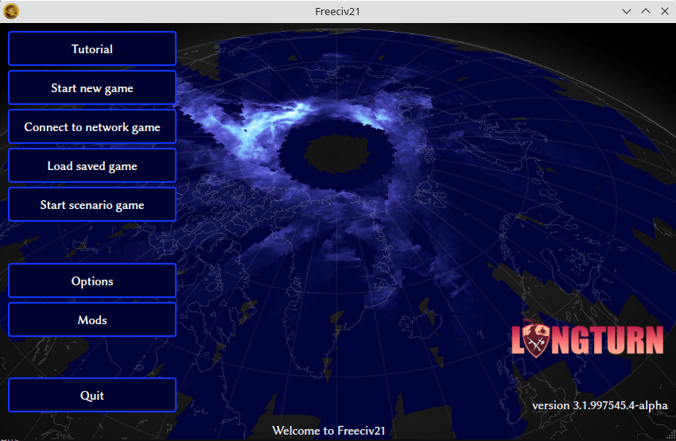
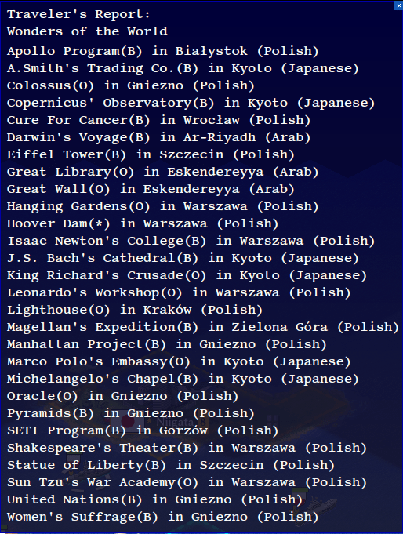
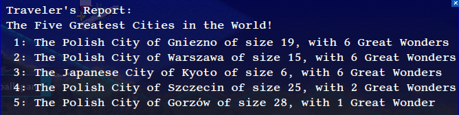
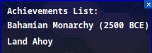
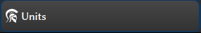
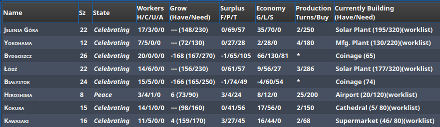
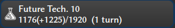
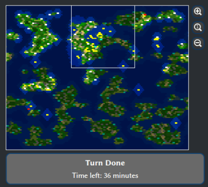

Freeciv21 Client Manual
***********************

.. Custom Interpretive Text Roles for longturn.net/Freeciv21
.. role:: unit
.. role:: improvement
.. role:: wonder

The Freeciv21 client (``freeciv21-client``) is the main user interface that allows one to play single player
and online multiplayer games. This manual will mostly track what is in the ``master`` branch of the Freeciv21
GitHub Repository at https://github.com/longturn/freeciv21/tree/master. You can see the date that this file
was last updated at the bottom of this page in the footer.

Getting Started
===============

If you have not installed Freeciv21, then obviously you need to start :doc:`there <../install>`.

If you are having trouble, come find the LongTurn Community on Discord at https://discord.gg/98krqGm. A good
place to start is the ``#questions-and-answers`` channel.

Launching the Client
====================

Depending on how you installed Freeciv21 will determine how you launch it. If you installed with one of the
precompiled binary packages, then you should find Freeciv21 in your OS's launcher, Start Menu, etc. If you
compiled the code yourself, then you will go to the location you asked ``--target install`` to place the
files. Double-clicking ``freeciv21-client`` should start it up.

.. _Start Screen:

    Start Screen with NightStalker Theme

The following buttons are available on the :guilabel:`Start Screen`:

* :guilabel:`Start New Game` -- Start a new single player game. See `Start New Game`_ below.
* :guilabel:`Connect to Network Game` -- Connect to a LongTurn mutliplayer game or one you host yourself. See
  `Connect to Network Game`_ below.
* :guilabel:`Load Saved Game` -- Load a previously saved single player game. See `Load Saved Game`_ below.
* :guilabel:`Start Scenario Game` -- Start a single player scenario game. See `Start Scenario Game`_ below.
* :guilabel:`Options` -- Set client options. See `Options`_ below.
* :guilabel:`Quit` -- Quit Freeciv21

.. Note:: Notice that there is not a :guilabel:`Help` button available. This is by design. The in-game help is
  compiled at run-time based on the ruleset you select and other server settings you may set.

Start New Game
--------------

Clicking :guilabel:`Start New Game` is used to start a new single player game. When clicked the following
dialog will appear.

.. _Start New Game Dialog:
.. figure:: ../../_static/images/gui-elements/start-new-game.png
    :scale: 55%
    :align: center
    :alt: Freeciv21 Start New Game dialog
    :figclass: align-center

    Start New Game Dialog

From upper left to lower right, the following user interface elements are available:

* :guilabel:`Players List`
* :guilabel:`Nation`
* :guilabel:`Rules`
* :guilabel:`Number of Players`
* :guilabel:`AI Skill Level`
* :guilabel:`More Game Options`
* :guilabel:`Interface Options`
* :guilabel:`Server Output Window`
* :guilabel:`Server Chat/Command Line`
* :guilabel:`Disconnect`
* :guilabel:`Observe`
* :guilabel:`Start`

Players List
^^^^^^^^^^^^

The :guilabel:`Players List` table shows information about the configured players in the game. The information
shown in :numref:`Start New Game dialog` is what a single player game looks like. A LongTurn multiplayer game
will look very similar, except that all the player's aliases will be shown as set up by the game
administrator. You can right-click on a player's row to configure details about the specific player:

* :guilabel:`Observe` -- Allows you to connect to a running game and observe that player. This is useful
  during LongTurn multiplayer games when you want to connect and see what a player is doing, but you cannot
  make any actual moves for the player. This works for LAN games as well. You can also use the server
  chat line and issue this command: ``/observe <player>``.
* :guilabel:`Remove Player` -- Removes the player from the list.
* :guilabel:`Take This Player` -- Allows you to claim this player as your own and then when you click
  :guilabel:`Start` you will join the game as that player. This is a required step for LongTurn multiplayer
  games at the start of a new game. Subsequent logins to a game when you `Connect to Network Game`_ will not
  require another ``take`` action. You can also use the server chat line and issue this command:
  ``/take <player>``
* :guilabel:`Pick Nation` -- Allows you to choose the Nation of the player. See `Nation`_ below.
* :guilabel:`Set Difficulty` -- Set the difficulty of the AI.
* :guilabel:`Put on Team` -- Combine players into teams.
* :guilabel:`AI Toggle Player` -- Toggle if the player is an AI or a human. This is needed before you can use
  the ``take`` option above as players when added are AI by default.

Nation
^^^^^^

Clicking on the button that says :guilabel:`Random` as shown in :numref:`Start New Game Dialog` above,
Freeciv21 will bring up a dialog box allowing you to pick the nation you want to play as shown in
:numref:`Select Nation Dialog` below. Freeciv21 comes with hundreds of available nations to pick from. Each
nation has a city graphics style that is automatically selected, but you can also change it. You can pick from
European, Classical, Tropical, Asian, Babylonian, and Celtic. You can also change the gender of your empire's
leader between male and female. Lastly you can use the built-in leader names or enter one of your choosing.

.. _Select Nation dialog:
.. figure:: ../../_static/images/gui-elements/pick-nation.png
    :scale: 65%
    :align: center
    :alt: Freeciv21 Select Nation dialog
    :figclass: align-center

    Select Nation Dialog

Rules
^^^^^

Freeciv21 comes with a collection of rulesets that define the game parameters. Rulesets control all the
aspects of playing a game. For more information on rulesets, you can refer to :doc:`../../Modding/index`, and
scroll down to the Rulesets section.

Freeciv21 comes with the following rulesets:

* Alien
* Civ1
* Civ2
* Civ2Civ3
* Classic (Default)
* Experimental
* Multiplayer
* Royale

Number of Players
^^^^^^^^^^^^^^^^^

The spinner can be changed up or down to customize the number of players. The ruleset can also set the number
of players, so be sure to pick the ruleset before you pick the number of players.

AI Skill Level
^^^^^^^^^^^^^^

This box will do a mass-change for all the AIs to be the same level. If you want to customize this, then
use the `Players list`_ right-click menu.

More Game Options
^^^^^^^^^^^^^^^^^

Clicking on this button will bring up the :guilabel:`Game Options` dialog box as shown in
:numref:`Game Options dialog` below. From here you can customize other settings for the game before you start
it. The ruleset defines many of these options, so be sure to select the ruleset you want to play before
attempting to set other settings. You can hover the mouse over the entries to get an explanation of what the
setting does.

.. _Game Options dialog:

    Game Options dialog

Interface Options
^^^^^^^^^^^^^^^^^

Refer to the section on `Options`_ below.

Server Output Window
^^^^^^^^^^^^^^^^^^^^

When you pick a ruleset, you will often see a bunch of output inside of this window. Also, if you make changes
to the game in `More Game Options`_, you will see output from those settings in this window as well. This is
actually a good way to learn what the varying game options are that can be issued via the
`Server chat/command line`_. This window is read-only, however you can select text from it and copy it to
paste in a text file if needed.

Server Chat/Command Line
^^^^^^^^^^^^^^^^^^^^^^^^

The :guilabel:`Server Chat/Command Line` is a text box below the server output window. From here you can
manually enter ``/set`` commands to the server directly if you know what you want to set.

Disconnect
^^^^^^^^^^

Clicking this button takes you back to the :guilabel:`Start Screen` as shown in :numref:`Start Screen`. The
local ``freeciv21-server`` instance will terminate at this time. A subsequent click of
:guilabel:`Start New Game` will spawn a new instance of the server, however any changes made previously will
be lost and you will have to start over.

Observe
^^^^^^^

This button allows you to do a :strong:`global` observe of all players. This is a special server setting and
is not enabled by default, however it is available in single player games. If you are globally observing a
game, you can right-click on the `Nations and Diplomacy View`_ button in the `Top Function Bar`_, and select
a particular nation to observe.

Start
^^^^^

When you are finished with all the settings, clicking :guilabel:`Start` will cause the game to start!

Connect to Network Game
-----------------------

When you click on the :guilabel:`Connect to Network Game` button, a dialog box will appear as in
:numref:`Server Connect dialog` below.

.. _Server Connect Dialog:

    Server Connect Dialog

There are three ways to connect to a server:

#. :strong:`A Local Server`: If you are hosting a local server on the same IP subnet as the client, then it
   will show in the :guilabel:`Local Server` box at the top.
#. :strong:`An Internet Server`: If the LongTurn community lists running games on its internet metaserver,
   games will show here and can be connected to via the :guilabel:`Internet Servers` box in the middle.
#. :strong:`Manually`: If you simply need to connect to a remote server and you know the the
   :guilabel:`Servername` and :guilabel:`Port`, then this is your option.

For the first two options you will select the server in the table and ensure that your :guilabel:`Username` is
correct and then click :guilabel:`Connect` to connect to the server. The :guilabel:`Password` box will
activate when you have connected to the server. Type in your password and then click :guilabel:`Connect` a
second time and you will join the server.

For the last option, enter in the server name or IP address into the :guilabel:`Connect` text box and the
server port in the corresponding :guilabel:`Port` text box. Ensure your username is correct and then
click :guilabel:`Connect` to connect to the server. The :guilabel:`Password` box will activate when you have
connected to the server. Type in your password and then click :guilabel:`Connect` a second time and you will
join the server. Pretty much all LongTurn online multiplayer games are connected this way.

.. Note:: If you are hosting your own server with authentication enabled and a player has never connected
  before they may be prompted to confirm the password a second time in the :guilabel:`Confirm Password` box
  before being allowed to connect.

Load Saved Game
---------------

When you click on the :guilabel:`Load Saved Game` button, a dialog box will appear as in :numref:`Load Saved
Game Dialog` below. Find the saved game you want to load and click (select) it in the table.

.. _Load Saved Game Dialog:
.. figure:: ../../_static/images/gui-elements/saved-game.png
    :scale: 65%
    :align: center
    :alt: Freeciv21 Load Saved Game dialog
    :figclass: align-center

    Load Saved Game Dialog

Freeciv21 will show you a sample of the game map and some information about the game. If this is not what you
were looking for, select another save from the table. When you have found the save you want to load, click on
the :guilabel:`Load` button and you will be placed in the game at the save point.

Alternately, you can click on the :guilabel:`Browse` button to browse your local filesystem to pick a saved
game that is not in your user profile.

Start Scenario Game
-------------------

When you click on the :guilabel:`Start Scenario Game` button, a dialog box will appear as in
:numref:`Scenarios Dialog` below. You can click on a scenario to select it and see information about the
selected scenario on the panel to the right side. When you have found the scenario you want to run, click on
the :guilabel:`Load Scenario` button. This will bring up the new game dialog as shown in :numref:`Start New
Game Dialog` above. When ready, click :guilabel:`Start` to begin the scenario game.

.. _Scenarios Dialog:

    Scenarios Dialog

.. Tip:: If you are new to Freeciv21, the ``tutorial`` scenario will walk you through about 100 turns worth
  of tips on how to get started playing a single player game.

Clicking on the :guilabel:`Browse` button will bring a filesystem browser that you can use to pick a
scenario file in an alternate location. Clicking on :guilabel:`Cancel` will bring you back to the
`Launching the client`_ start screen.

Options
-------

From the Start Screen, as shown in :numref:`Start Screen`, when you click on the :guilabel:`Options` button, a
dialog box will appear as in :numref:`Interface Options dialog` below. This dialog allows you to set a myriad
of options that affect the look and feel of the user interface when you are playing a game.

The interface options dialog box can also be opened while in a game via the
:menuselection:`Game --> Interface Options` menu as well as from the `Start New Game`_ dialog by clicking on
the :guilabel:`Interface Options` button.

.. _Interface Options dialog:

    Interface Options dialog

The Interface Options dialog is broken down into the following tabs:

* :guilabel:`Network`: On this tab you can save your preferred username, server and port information to be
  used during `Connect to Network Game`_.
* :guilabel:`Sound`: On this tab you can set everything related to in game sound and music.
* :guilabel:`Interface`: On this tab you can set anything related to how you interact with the interface of the
  client while playing a game.
* :guilabel:`Graphics`: On this tab you can change the look and feel with a different theme. NightStalker is
  the default theme out of the box. You can also set the default tileset to use under different map styles as
  well as various things you may or may not want the client to paint (draw) on the screen.
* :guilabel:`Overview`: On this tab turn various features of the minimap on and off.
* :guilabel:`Map Image`: Freeciv21 can save summary images of the map every turn. This tab allows you to
  configure how you want to do that. Refer to `Game Menu`_ for more information.
* :guilabel:`Font`: There is a collection of font styles used by the client. This tab allows you to tailor
  them to your own favorites.

The buttons along the bottom of the dialog box are:

* :guilabel:`Reset`: Clicking this button will reset all the options to the out of box defaults.
* :guilabel:`Cancel`: Clicking this button will either return you to the `Launching the Client`_ start screen
  or close the dialog and drop you back to the `Map View`_ if requested from the :guilabel:`Game` menu.
* :guilabel:`Refresh`: If you used the modpack installer to add a new tileset, soundset, or musicset with the
  local options dialog open, you can use the :guilabel:`Refresh` button to reload the available choices for
  some of the drop down selection boxes. For more information on the modpack installer, refer to
  :doc:`modpack-installer`.
* :guilabel:`Apply`: Apply the settings as set to the client for immediate effect. This button will not do
  much if local options was called from the `Start New Game`_ dialog box.
* :guilabel:`Save`: Save the current settings.
* :guilabel:`OK`: Apply the settings and close the dialog box. This button does not do a save operation by
  default.

Main Client Interface
=====================

Regardless the method you used to get into a game, eventually you will make it to the main client interface as
shown in :numref:`Client Overview` below. This is known as the `Map View`_.

.. _Client Overview:
.. figure:: ../../../dist/freeciv-screenshot-2048x1112.png
    :scale: 40%
    :align: center
    :alt: Freeciv21 client overview
    :figclass: align-center

    Freeciv21 Client Overview

The client interface is broken down into a collection of sections. From the top, the sections are:

* :strong:`Menu Bar`: Like many programs, Freeciv21 has a menu bar at the top. For details see `Menu Bar`_.
* :strong:`Top Function Bar`: This top bar is a big aspect of playing any Freeciv21 game. More details are
  available in the `Top Function Bar`_ section.
* :strong:`The Main Map`: This is the main canvas of the game. This is where your empire will either thrive
  or be destroyed by your enemies. Refer to `Map View`_ for more information.
* :strong:`Unit Controls`: :numref:`Client Overview` shows a :unit:`Battleship` selected and the available
  unit actions in a bar at the bottom middle of the interface. This is the `Unit Controls`_ bar.
* :strong:`Minimap`: In the lower right corner of the main map interface is a small version of the map known
  as the `Minimap`_.

Menu Bar
--------

The Menu Bar consists of the following items:

* `Game Menu`_
* `View Menu`_
* `Select Menu`_
* `Unit Menu`_
* `Combat Menu`_
* `Work Menu`_
* `Multiplayer Menu`_
* `Civilization Menu`_
* `Help Menu`_

Game Menu
^^^^^^^^^

The :guilabel:`Game` menu is used to conduct global level options on the client or the game being played. It
has the following options:

Save Game
    Saves the game as it is :strong:`right now` to the default save location.

Save Game As ...
    Saves the game as it is :strong:`right now` to a location of your choosing.

Save Map to Image
    Save a ``.png`` image file of the map to the user's profile directory.

Set Local Options
    Opens the :guilabel:`Local Options` dialog box as described in the `Options`_ section above.

Server Options
    Opens the :guilabel:`Server Options` dialog as described in the `More Game Options`_ section
    above.

Messages
    Opens the :guilabel:`Message Options` dialog as shown in :numref:`Message Options Dialog` below. The
    screenshot only shows a few rows of available options, many more will be found in the client. Any item
    with a check mark in the :guilabel:`Out` column will be shown in the :guilabel:`Server Log/Chat` widget.
    Any item with a check mark in the :guilabel:`Mes` column will be shown in the :guilabel:`Messages` widget
    (see `Messages`_). Lastly, any item with a check mark in the :guilabel:`Pop` column will be shown in a pop
    up message box window.

.. _Message Options Dialog:
.. figure:: ../../_static/images/gui-elements/message-options.png
  :scale: 65%
  :align: center
  :alt: Freeciv21 Message Options dialog
  :figclass: align-center

  Message Options Dialog

Shortcuts
    Opens the :guilabel:`Shortcuts` dialog as shown in :numref:`Shortcut Options Dialog` below. The dialog is
    used to set the preferred keyboard shortcuts to be used in the game. The screenshot only shows a few rows
    of available options, many more will be found in the client. To override the default, click your mouse
    cursor on the box on the right and then type the shortcut you want to set the setting to. For example: You
    want to change the :guilabel:`Scroll Map` option to the :guilabel:`PgUp` key, you would click in the box
    and then press the :guilabel:`PgUp` key on your keyboard. To reset to defaults, you can click on the
    :guilabel:`Reset` button. Click :guilabel:`Save` and then :guilabel:`Close` when finished.

.. _Shortcut Options Dialog:
.. figure:: ../../_static/images/gui-elements/shortcut-options.png
  :scale: 65%
  :align: center
  :alt: Freeciv21 Shortcut Options dialog
  :figclass: align-center

  Shortcut Options Dialog

Load Another Tileset
    Opens the :guilabel:`Available Tilesets` dialog as shown in :numref:`Available Tilesets Dialog` below. You
    can select any tileset installed by clicking on the name. You may get an error message if the tileset is
    not compatible with the current ruleset (for example: if it lacks a unit).

.. _Available Tilesets Dialog:

  Available Tilesets Dialog

Tileset Debugger
    Opens the :guilabel:`Tileset Debugger` dialog. This option is documented in
    :doc:`../../Modding/Tilesets/debugger`

Save Options Now
    Save the settings set in `Options`_ immediately.

Save Options on Exit
    Saves the settings set in `Options`_ when the client is exited.

Leave Game
    Allows you to leave the game and return to the start screen.

Quit
    Quits the client after a confirmation dialog box.

View Menu
^^^^^^^^^

The :guilabel:`View` enables a user to manipulate what is shown on the `Map View`_ as well as varying degrees
of zooming in and out.

The :guilabel:`View` menu has the following options:

Center View
    With a unit selected, this menu option will place the unit in the center of the screen.

Fullscreen
    Sets Freeciv21 to use the whole screen, removing the title bar and operating system Task bar.

Minimap
    Shows or hides the `Minimap`_ in the lower right corner.

Show New Turn Information
    Enables or Disables populating new turn information into the `Messages`_ widget.

Show Detailed Combat Information
    Enables or Disables populating detailed combat information into the `Messages`_ widget. Detailed combat
    information looks like this:

.. code-block:: rst

    Your {veteran level} {unit name} [id:{number} D:{defense} HP:{hit points}] lost to an
    attack by the {enemy nation} {veteran level} {unit name} [id:{number} A:{attack} lost
    {number} HP, has {number} HP remaining and achieved the rank of {veteran level}].

Lock Interface
    Locks the user interface, preventing the move of objects around such as the server log/chat widget.

Zoom In
    Each selection of this menu option (or corresponding keyboard shortcut or user interface button next to
    the `Minimap`_) will zoom in on the `Map View`_ one level.

Zoom Default
    Resets the zoom level to the default position at Zoom Level 0.

Zoom Out
    Each selection of this menu option (or corresponding keyboard shortcut or user interface button next to
    the `Minimap`_) will zoom out on the `Map View`_ one level.

Scale Fonts
    Enables fonts to scale along with the zoom level.

Citybar Style
    This menu has a sub-menu of three options: :guilabel:`Simple`, :guilabel:`Traditional`, and
    :guilabel:`Polished` as shown in :numref:`Citybar Style Simple`, :numref:`Citybar Sytle Traditional`,
    and, :numref:`Citybar Style Polished`, respectively.

.. _Citybar Style Simple:
.. figure:: ../../_static/images/gui-elements/citybar-simple.png
  :align: center
  :alt: Citybar style - Simple
  :figclass: align-center

  Citybar Style - Simple

.. _Citybar Sytle Traditional:

  Citybar Style - Traditional

.. _Citybar Style Polished:

  Citybar Style - Polished

City Outlines
    Enables or Disables the display on the `Map View`_ of the city's vision radius or outline.

City Output
    Enables or Disables the display on the `Map View`_ the city's food, production, and trade as shown
    in the `City Dialog`_.

Map Grid
    Enables or Disables the display on the `Map View`_ the tile grid. This can be useful to help differentiate
    individual tiles from others.

National Borders
    Enables or Disables the display on the `Map View`_ the national borders of your neighbors. Each nation is
    given a color at game start (as seen on the `Nations and Diplomacy View`_).

Native Tiles
    Enables or Disables the display on the `Map View`_ tiles that are native to the unit selected. Non-native
    tiles are marked with a red hash. Non-Native means that the unit cannot move there.

City Names
    Enables or Disables the display on the `Map View`_ the names of cities in the city bar.

City Growth
    Enables or Disables the display on the `Map View`_ the growth of cities in the city bar.

City Production Levels
    Enables or Disables the display on the `Map View`_ the production of cities in the city bar.

City Buy Cost
    Enables or Disables the display on the `Map View`_ the cost to buy the currently constructed item in the
    city bar.

City Traderoutes
    Enables or Disables the display on the `Map View`_ trade routes between cities.

Select Menu
^^^^^^^^^^^

The :guilabel:`Select` is used to select units on the game map in varying degrees. It has the following
options:

Single Unit (Unselect Others)
    Assuming you have selected multiple units (such as the next menu for :guilabel:`All on Tile`) and you want
    to quickly undo that. This menu supports that function.

All on Tile
    Quickly select all of the units on the same tile. This assumes that multiple units of different type are
    stacked on the same tile.

Same Type on Tile
    Quickly select all of the units of the same type on the tile. This assumes that multiple units of
    different types are stacked on the same tile.

Same Type on Continent
    Works the exact same way as the menu option above (:guilabel:`Same Type on Tile`) but expands the
    selection to the same island or continent.

Same Type Everywhere
    Even larger window of unit selection to pick all of the same type, but in all locations across the
    `Map View`_. This is useful to help you find units placed in allied cities or to conduct a mass
    airlift.

Wait
    If you are not ready to move the currently selected unit, you can tell it to :strong:`wait` with this menu
    option. The rotation of unit selection will bypass this unit and will come back until you either
    move the unit or tell it you are done.

Done
    If you have moved the unit, but still have move points left or are simply done working with the unit for
    you can tell the client you are finished (done) with it with this menu item.

Advanced Unit Selection
    Opens the :guilabel:`Advanced Unit Selection` dialog box as shown in
    :numref:`Advanced Unit Selection Dialog` below. This dialog box gives you options to select a group of
    units using a more nuanced grouping method than the other :guilabel:`Select` menu options.

.. _Advanced Unit Selection Dialog:
.. figure:: ../../_static/images/gui-elements/advanced-unit-selection.png
  :align: center
  :scale: 75%
  :alt: Freeciv21 Advanced Unit Selection dialog
  :figclass: align-center

  Advanced Unit Selection Dialog

Unit Menu
^^^^^^^^^

The :guilabel:`Unit` menu is used to give units orders. It has the following options:

Go to Tile
    With a unit selected, give the unit orders to go to a selected tile on the map.

Go to and ...
    Similar to :guilabel:`Go to Tile` above, however when the unit reaches the given tile you can give the
    unit a specific command to do as selected from the sub-menu. This is useful, for example, for
    :unit:`Settler` units to have them go to a spot and build a city as soon as possible.

Go to Nearest City
    Instruct the unit to go to the nearest city. Nearest in this context is the one that can be reached in
    the fewest move points (MPs).

Go to/Airlift to City...
    If Airlifting is enabled in the game (and assuming you have any required city improvement(s) that are
    required for Airlifting), you use this menu to tell the unit to transport to a city with the Airlift
    capability. A dialog box will pop up asking what city you want to Airlift to.

.. tip:: Depending on the game rules, a player could use the :guilabel:`Select` menu to select many units of a
  similar type and then use this menu item to Airlift a great number of units all in one move very quickly.

Autoexplore
    Ask the unit to automatically open up the unknown (the area of the map that is black and has not been
    visited by any of your units).

Patrol
    Instruct a unit to make a collection of moves in a pattern as part of a patrol route.

Sentry
    Ask a unit to :strong:`Sentry`. Sentry is not the same as :strong:`Fortify` as found in the
    :guilabel:`Combat` menu. A sentried unit is on lookout and will give notice if another unit from an
    opponent comes into its field of vision.

.. note:: A sentried unit does not gain a fortification bonus when outside of a city. However, sentried
  units inside of cities gain a default fortification bonus while in the city.

Unsentry All On Tile
    Instruct a stacked set of units on a single tile to stop that activity and ask for new orders.

Load
    Load a unit into a transporter, such as a :unit:`Caravel`, :unit:`Galleon`, or :unit:`Transport` ship.

Unload
    Unload a unit from a transporter.

Unload All From Transporter
    If you have many units inside of a transporter and you want all of them to disembark at the same time,
    then you can use this menu to make that nice and easy.

Set Home City
    Transfers ownership and management (e.g. support) of a unit to the city that it is currently present in.
    This menu allows you to shift support of units around to help with the cost of supporting units. Refer to
    `Economics View`_ for more information on unit support costs.

Upgrade
    Upgrade a unit from one level to another. For example, :unit:`Phalanx` units are often upgradeable to an
    improved :unit:`Pikemen` with the discovery of :strong:`Feudalism`. The upgrade will cost gold and the
    client will tell you what that cost is before you agree to the spend.

Convert
    Similar to :guilabel:`Upgrade`. The convert option allows you to change a unit from one type to another.
    This is ruleset dependent and is not available in all rulesets.

Disband
    Use this menu option to eliminate (kill, destroy, fire) a unit. If performed inside of a city, then 50% of
    the shields used in the production of the unit is given to the city and helps build whatever is currently
    under construction. If a unit is disanded outside of a city, there is no benefit other than the
    elimination of shield or gold upkeep depending on your form of government.

Rename
    Give the unit a unit name. Similar to many Naval vessels in real life, you can name your units with a
    special name.

Combat Menu
^^^^^^^^^^^

The :guilabel:`Combat` menu is used to give combat units orders. It has the following options:

Fortify Unit
    Instruct the unit to :strong:`Fortify` on the tile. An icon will show on the unit signifying
    fortification. By fortifying, the unit is given a defensive bonus depending on the terrain it is on. See
    in game help for more specifics of what defense bonuses are given by terrain type. When a unit is
    fortifying, it is not in :strong:`Sentry` mode and will not inform you of enemy unit movement inside of
    its vision radius.

Build Fortress/Buoy
    Some units have the ability to build forts, fortresses, and buoys. They are typically :unit:`Workers` or
    :unit:`Engineers`. In some rulesets, :unit:`Transports` can build Buoys. Forts, Pre-Forts, and Fortresses
    give a unit increased defensive bonuses in addition to what is provided by the base terrain. See in
    game help for the specifics. Buoys are used to act as sentries in the oceans around your cities and can
    give you opponent unit movement information.

Build Airbase
    Instructs a unit to build an Airbase. This is often a requirement for Airlifting in many rulesets. They
    also often give the ability to heal an aircraft type unit faster while on the tile.

Build Base
    This generic menu will include a sub-menu of all of the base type tile improvements that can be built
    as defined by the current ruleset.

Pillage
    Tells a unit to remove (pillage) tile infrastructure improvements such as roads, railroad, and bases.

Do ...
    A dialog box will pop up here and give you all of the actions that the unit selected can perform.

Work Menu
^^^^^^^^^

The :guilabel:`Work` menu is used to give units infrastructure work orders such as building roads, irrigation,
or mines. Tile infrastructure improvements are mostly done with :unit:`Workers` and :unit:`Engineers`, however
some rulesets allow other units to perform this type of work. See in game help on units for details. It has
the following options:

Build City
    Certain units such as :unit:`Settlers` can create cities. If the unit has sufficient move points available,
    then giving this command will build a new city where the unit is currently placed on the `Map View`_. The
    unit will be consumed by the action.

Auto Worker
    Tell a :unit:`Worker` to use an in game algorithm to improve tiles. The game engine will give the
    :unit:`Worker` instructions so you do not have to.

Build Road/Railroad/Maglev
    Tell a :unit:`Worker` to build a road. If sufficient technological knowledge is available, then a railroad
    and eventually a maglev may be able to be constructed at a later time during the game. The menu will
    change with the best available option depending on what has been done to improve the tile in the past.

Build Path
    Provides a sub-menu of all of the pathing options available for the tile. This is mostly road, railroad,
    and maglev. Other rulesets may have different path types. See in game help for more details.

Build Irrigation/Farmland
    Tell a :unit:`Worker` to irrigate the tile in order to improve the food output from the tile. If
    sufficient technological knowledge is available, then farmland may be added to the tile at a later
    time during the game. The menu will change with the best available option depending on what has been
    done to improve the tile in the past.

Cultivate to Plains
    Cultivation is a multi-step process where a tile is converted from one type to another. Such as converting
    a swamp to plains. Not all tile terrain types can be cultivated to other types. See in game help for
    details.

Build Mine
    Tells a :unit:`Worker` to build a mine on a tile to improve the shield output.

Plant Forest/Swamp
    If the unit is on a grassland tile, then you can tell the :unit:`Worker` to plant a forest on the tile. If
    the unit is on a forest tile, then you can tell the :unit:`Worker` to convert the forest to swamp.

Connect with Road
    Tell a :unit:`Worker` to build a road many times along a given path.

Connect with Railroad/Maglev
    Tell a :unit:`Worker` to build a railroad or maglev many times along a given path.

Connect with Irrigation
    Tell a :unit:`Worker` to connect many tiles together with irrigation. This is often done to get
    irrigation from a source of fresh water over to a city.

Transform to Hills/Swamp/Ocean
    Tell an :unit:`Engineer` to conduct a major terraforming operation on the tile. Mountains can be cut down
    to hills, forests, and grassland can be converted to swamp and then the swamp can be converted to ocean.
    In some circumstances, an ocean tile can be converted to swamp and then the swamp can be converted to
    grassland. In most rulesets, only the :unit:`Engineer` unit can do these major operations.

Clean Pollution
    Tell a :unit:`Worker` to clean pollution from the tile. Pollution on a tile will eliminate or severely
    cripple the output of a tile and contributes to global warming.

Clean Nuclear Fallout
    If a :unit:`Nuclear` unit has been detonated nearby (e.g. attacked a city), then there will be nuclear
    fallout all over the place. Similar to pollution, nuclear fallout severely cripples the output of a tile
    and contributes to nuclear winter.

Help Build Wonder
    Certain units, such as :unit:`Caravan` can be used to move production from one city to another and help
    build small and great wonders. This menu aids that function. Alternately you can simply "walk the
    :unit:`Caravan` into a city and a pop up dialog will ask what you want to do.

Establish Trade Route
    Certain units, such as :unit:`Caravan` can be used to establish a trade route between two cities. This
    menu aids that function.

As you can see, there are a number of ways that a tile can be altered with infrastructure improvements. Be
sure to have a close look at the in game help on Terrain for more information.

Multiplayer Menu
^^^^^^^^^^^^^^^^

The :guilabel:`Multiplayer` menu has a collection of functions to aid certain multiplayer games. Many of
the options are specifically tailored to the MP2c and WarCiv rulesets. It has the following options:

Delayed GoTo
    Give a unit orders to move at a specific time in the turn. This assumes that the turn is time based.

Delayed Orders Execute
    Execute an action by a unit at a specific time in the turn. This assumes that the turn is time based.

Clear Orders
    Clear any delayed orders from the above two menu items.

Add All Cities to Trade Planning
    All all current cities in your into an advanced trade planning array. This is used by the WarCiv
    ruleset.

Calculate Trade Planning
    Run a trade effectiveness algorithm across all of the cities in the trade plan to determine the best
    routes. This is used by the WarCiv ruleset.

Add/Remove City
    Add or remove a city from the trade planning array.

Clear Trade Planning
    Clear all trade planning to start over.

Automatic Caravan
    Any :unit:`Caravan` units built by a city will follow the trade planning output for that city. This is
    used by the WarCiv ruleset.

Set/Unset Rally Point
    Set or remove a rally point to easily send units, once produced, to a specific spot on the game map.

Quick Airlift
    Depending on what is selected in the menu below, you can quickly airlift a unit to a destination city.

Unit Type for Quickairlifting
    Select the type of unit that will be quickly airlifted by the menu above.

Default Action vs Unit
    A sub-menu will show some optional actions that a unit should do by default against another unit.
    The default is :strong:`Ask`.

Default Action vs City
    A sub-menu will show some optional actions that a unit should do by default against a city.
    The default is :strong:`Ask`.

Civilization Menu
^^^^^^^^^^^^^^^^^

The :guilabel:`Civilization` menu is used to gain access to many functions of your empire. You can load up
pages for units, cities, nations, etc; change the form of government and see how you are doing compared to
your opponents with the demographics report. It has the following options:

Tax Rates
    Selecting this menu item will bring up a dialog box allowing you to set the rate in percentage points for
    gold (taxes), science (bulbs), and luxury (goods). This is the same as clicking on the `Tax Rates View`_
    button on the `Top Function Bar`_. :numref:`Tax Rates Dialog` dialog below, shows a sample screenshot.
    In this example, the player's nation is in Democracy, has set gold to 40%, science to 40%, and luxury to
    20%.

.. _Tax Rates Dialog:
.. figure:: ../../_static/images/gui-elements/tax-rates.png
  :scale: 65%
  :align: center
  :alt: Freeciv21 Tax Rates dialog
  :figclass: align-center

  Tax Rates Dialog

.. note:: The phrase "tax rates" can be a bit misleading as there is only one taxable item and that is the
  rate for gold collection. Think of this feature of the game more like a "national budget". In Freeciv21,
  the national budget is simplified into three segments: gold collection, scientific output, and luxury goods.

Government
    Depending on your technological progress through the game, you may be able to select a different form
    of government. The change is achieved from this menu item. This is the same as clicking on the
    `National Status View`_ option on the `Top Function Bar`_.

View
    Clicking this menu item will show you the main game map. This is the same as clicking on the
    `Map View`_ option on the `Top Function Bar`_.

Units
    Clicking this menu item will show you the units report widget. This is the same as clicking on the
    `Units View`_ option on the `Top Function Bar`_.

Players
    Clicking this menu item will show you the nations and diplomacy view. This is the same as clicking on the
    `Nations and Diplomacy View`_ option on the `Top Function Bar`_.

Cities
    Clicking this menu item will show you the cities view. This is the same as clicking on the
    `Cities View`_ option on the `Top Function Bar`_.

Economy
    Clicking this menu item will show you the economics view. This is the same as clicking on the
    `Economics View`_ option on the `Top Function Bar`_.

Research
    Clicking this menu item will show you the research tree view. This is the same as clicking on the
    `Research View`_ option on the `Top Function Bar`_.

Wonders of the World
    Clicking this menu item will show you a traveler's report widget on the `Map View`_. The widget will give
    information on any cities that have constructed any of the great wonders.

.. _Wonders of the World:

  Wonders of the World

Top Five Cities
    Clicking this menu item will show you a traveler's report widget on the `Map View`_. The widget will give
    information on the top five largest cities.

.. _Top Five Cities:

  Top Five Cities

Demographics
    Clicking this menu item will show you a demographics report widget on the `Map View`_. The widget will
    give information about how your nation stacks up against your opponents. If you have an embassy with your
    opponents in the game, the demographics report will tell you who is #1, if you are not #1.

.. _Demographics:

  Demographics

Spaceship
    Clicking this menu item will show you the spaceship view. The space race is a ruleset defined option and
    is not enabled in all rulesets. Your nation must also be very technologically advanced to build the
    components needs for a spaceship. See in game help for more details.

    The client will automatically place the components for you as you construct them.

Achievements
    Clicking this menu item will show you an achievements report widget on the main map. Achievements are
    a ruleset defined option and not enabled by default in many rulesets.

.. _Achievements:

  Achievements

Help Menu
^^^^^^^^^

The :guilabel:`Help` menu gives you access to the in-game help. It has the following options: Overview,
Strategy and Tactics, Terrain, Economy, Cities, City Improvements, Wonders of the World, Units, Combat, Zones
of Control, Government, Effects, Diplomacy, Technology, Space Race, About Current Tileset, About Current
Ruleset, About Nations, Connecting, Controls, Citizen Governor, Chatline, Worklist Editor, Languages, Copying,
and About Freeciv21.

Each of these options is simply a quick link to the same named section in the game help menu.

Top Function Bar
----------------

The :guilabel:`Top Function Bar` is used to get to varying views (pages) in the game without having to us the
main menu, especially the :guilabel:`Civilization` menu.  The :guilabel:`Top Function Bar` is broken up into 9
sections, from left to right.

* `Map View`_
* `Units View`_
* `Cities View`_
* `Nations and Diplomacy View`_
* `Research View`_
* `Economics View`_
* `Tax Rates View`_
* `National Status View`_
* `Messages`_

Map View
^^^^^^^^

This is your primary playing surface. This is the map where you build your civilization. The button for this
is shown in :numref:`Map View Button` below. :numref:`Client Overview` above, has a good example of the
:guilabel:`Map View`.

.. _Map View Button:
.. figure:: ../../_static/images/gui-elements/top-bar-map.png
  :align: center
  :alt: Freeciv21 map
  :figclass: align-center

  Map View Button

If you hover your mouse over the :guilabel:`Map View` button, a pop up widget will appear and give you
information about your nation. The pop up widget shows: Nationality, Total Population, Year (Turn Number),
Gold (Surplus/Deficit), and Tax Rates.

To move around the map canvas, you can right-click in the main map area and the canvas will move. The further
from the center of the screen, the faster the map canvas will move per mouse click.

One other feature of the :guilabel:`Map View` is the ability to middle-click on a unit and a pop-up widget
will appear giving you some information about the unit. :numref:`Unit Information`, gives an example of a
:unit:`Howitzer`.

.. _Unit Information:
.. figure:: ../../_static/images/gui-elements/unit-info.png
  :scale: 65%
  :align: center
  :alt: Freeciv21 Unit Information
  :figclass: align-center

  Map View - Unit Information

Units View
^^^^^^^^^^

The :guilabel:`Units View` is a widget on the `Map View`_ that shows what units you have available and how
many are being produced. The `Cities View`_ can tell you which cities are producing what unit. :numref:`Units
View Button` shows the button to bring up the widget. Clicking the button a second time will close the widget.

.. _Units View Button:

  Units View Button

The :guilabel:`Units View` has two modes. For regular games without the ``unitwaittime`` server setting set,
you get something similar to :numref:`Units View`. If you are playing a game with ``unitwaittime`` set, then
you will see a table below the widget, such as :numref:`Units View UWT`, that displays the amount of time
until the unit can move.

.. _Units View:
.. figure:: ../../_static/images/gui-elements/units-report.png
  :align: center
  :scale: 50%
  :alt: Freeciv21 Units Report
  :figclass: align-center

  Units View

.. _Units View UWT:
.. figure:: ../../_static/images/gui-elements/units-report-uwt.png
  :align: center
  :scale: 65%
  :alt: Freeciv21 Units Report w/ unitwaittime
  :figclass: align-center

  Units View with ``unitwaittime``

Cities View
^^^^^^^^^^^

The :guilabel:`Cities View` is a separate page in a table format. When you click the button for it as shown in
:numref:`Cities View Button`, the client will switch to a listing of your cities.

.. _Cities View Button:
.. figure:: ../../_static/images/gui-elements/top-bar-cities.png
  :align: center
  :alt: Freeciv21 Cities
  :figclass: align-center

  Cities View Button

:numref:`Cities` gives an example of the :guilabel:`Cities View` in the client with the default columns
displayed. If you right-click on the table heading, you will be given a list of other columns you may want to
show. If you change anything, then be sure to save the settings from the :guilabel:`Game` menu.

.. _Cities:

  Cities

If you double-click on a city row, the game will switch to the `Map View`_ and open the `City Dialog`_ for
that city. When you close the `City Dialog`_, the client will not bring you back to the
:guilabel:`Cities View`. If you right-click on a city's row, a pop-up menu will appear. From this menu you can
change what the city is producing, set a citizen governor, sell a city improvement, conduct an advanced
selection of cities, buy what is currently being produced, and center the city on the map. If you choose to
center the city on the map, the client will close the :guilabel:`Cities View` and open the `Map View`_ and
place the city in the center of the screen.

Nations and Diplomacy View
^^^^^^^^^^^^^^^^^^^^^^^^^^

The :guilabel:`Nations and Diplomacy View` is actually two views accessed from the same place on the `Top
Function Bar`_. When you click the button for it as shown in :numref:`Nations and Diplomacy View Button`, the
client will switch to a list of nations that you are playing against in a table format.

.. _Nations and Diplomacy View Button:
.. figure:: ../../_static/images/gui-elements/top-bar-nations.png
  :align: center
  :scale: 50%
  :alt: Freeciv21 nations
  :figclass: align-center

  Nations and Diplomacy View Button

:numref:`Nations and Diplomacy View Button with Diplomacy View Open` gives a sample of the
:guilabel:`Nations View` in the client with all available columns displayed. If you right-click on the table
heading, you will be given a list of column names that you can enable or disable. If you change anything, then
be sure to save the settings from the :guilabel:`Game` menu.

.. _Nations View:

  Nations View

If you have an embassy with a nation you will be able to see much more in the table than if you do not have an
embassy. If you select the row of a nation you have an embassy with, you will be given some interesting
intelligence at the bottom of the page. :numref:`Nations Intelligence` gives an example.

.. _Nations Intelligence:
.. figure:: ../../_static/images/gui-elements/nations-intel.png
  :align: center
  :scale: 65%
  :alt: Freeciv21 nations intelligence
  :figclass: align-center

  Nations Intelligence

On the left you will see the name of the Nation, The name (username) of the Ruler, the current form of
Government, the Capital city, how much gold they have in the bank, the tax rates, research target, and culture
score.

.. note:: The Capital City will show as ``unknown`` if you have not seen the city on the `Map View`_. If it is
  in the unknown or has not been seen by one of your units, then you will not have knowledge of the Capital.

In the center you can see the relationship status of the nation across the game. If you see a half-moon icon
next to a nation, then the nation selected has given shared vision to that nation. In
:numref:`Nations Intelligence` above, you can see that the Aztecs have an alliance with the Iroquois and the
Arabs. The Aztecs also have shared vision with both of these nations.

On the right, you can see a comparison of technological research between your nation and the nation selected.

The :guilabel:`Nations and Diplomacy View` has a few buttons at the upper left. From left to right, they are:
:guilabel:`Meet`, :guilabel:`Cancel Treaty`, :guilabel:`Withdraw Vision`, and :guilabel:`Toggle AI Mode`. This
is how you access the :guilabel:`Diplomacy` component of the :guilabel:`Nations and Diplomacy View`.

Let us talk about the buttons from right to left as :guilabel:`Meet` takes the longest to describe. Depending
on the command line level you have in the game (default is ``hack`` for single player games), you may be able
to change a player from an AI to a human after a game has started to allow a human player to come into the
game. This is what the :guilabel:`Toggle AI Mode` button does. If the button is greyed out you cannot change
the AI mode in the game.

If you have previously shared vision via a treaty from the :guilabel:`Diplomacy View`, you can revoke it by
clicking on the :guilabel:`Withdraw Vision` button. Sharing vision is similar to you allowing another player
to see all of your territory.

If you have a relationship with a player other than :strong:`War`, you can cancel it with the
:guilabel:`Cancel Treaty` button. Relationship pacts can be changed with the :guilabel:`Diplomacy View`. Most
rulesets support :strong:`Cease Fire`, :strong:`Peace`, and :strong:`Alliance`.

.. note:: Some forms of government will not allow you to break a :strong:`Peace` or :strong:`Alliance` treaty
  without changing government to Anarchy.

Lastly, clicking :guilabel:`Meet` will bring up a diplomacy screen where you can interact with a player that
you have an embassy with. :numref:`Diplomacy`, shows a sample screen where the parties are agreeing to a cease
fire.

.. _Diplomacy:
.. figure:: ../../_static/images/gui-elements/diplomacy-meet.png
  :align: center
  :scale: 65%
  :alt: Freeciv21 diplomacy
  :figclass: align-center

  Diplomacy

If you wish to give gold to a player, enter in the amount in the :guilabel:`Gold` box. You can also add
clauses to the treaty by selecting from the :guilabel:`Add Clause` button. Depending on what is enabled in
your game, you can swap sea and world maps, trade cities, give advances, share vision, give an embassy, or
agree to peace or an alliance via a pact. If you are happy with the components of the treaty you can click the
:guilabel:`Accept Treaty` button. The client will change the thumbs-down icon to the right of your nation to a
thumbs-up showing agreement. If you do not want to do anything and definitely do not want to accept the
treaty, then you can click on the :guilabel:`Cancel Meeting` button. This will close the :guilabel:`Diplomacy
View` and return you to the :guilabel:`Nations View`.

.. note:: The ability to trade maps, cities, or advances is ruleset dependent and may not be enabled for all
  games. The other clauses such as share vision, give an embassy or change the relationship via a pact are
  enabled at all times.

.. tip:: You do not have to use the :guilabel:`Diplomacy View` to get an embassy with a player. You can always
  build a :unit:`Diplomat` unit and have that unit get an embassy by going to a player's city and "walk" into
  the city. An action dialog will show and you can establish an embassy without asking via diplomacy. See in
  game help for more information on using units to conduct many gameplay features besides simply establishing
  an embassy.

Lastly, you can see in :numref:`Diplomacy` above that there are more than one conversations occurring. Your
foreign state department is busy! If you happen to click out of the :guilabel:`Diplomacy View`, for example by
clicking on the button for the `Map View`_, the button for the :guilabel:`Nations and Diplomacy View` will
change from what is shown in :numref:`Nations and Diplomacy View Button` and instead will change to what is
shown in :numref:`Nations and Diplomacy View Button with Diplomacy View Open` below.

.. _Nations and Diplomacy View Button with Diplomacy View Open:
.. figure:: ../../_static/images/gui-elements/top-bar-nations-diplomacy.png
  :align: center
  :alt: Freeciv21 nations with diplomacy open
  :figclass: align-center

  Nations and Diplomacy View Button with Diplomacy View Open

To quickly access the :guilabel:`Diplomacy View`, you can right-click on the button to bring it up. A normal
left-click of the button will bring up the :guilabel:`Nations View` as shown in
:numref:`Nations and Diplomacy View Button with Diplomacy View open` above.

Research View
^^^^^^^^^^^^^

The :guilabel:`Research View` is a separate page showing the technology research tree. This is the page where
you instruct your scientists which technologies to research. When you click the button for it as shown in
:numref:`Research View Button`, the client will switch to your research tree.

.. _Research View Button:

  Research View Button

If you hover your mouse over the button, a pop up widget will appear and give you information about your
nation's research.

:numref:`Research Tree` below shows a sample of a :guilabel:`Research Tree`. In this picture the player has
actually finished all of the available technologies (known as completing the research tree) and is simply
researching "future" technologies.

.. _Research Tree:

  Research Tree

If nothing is being researched, the :guilabel:`Research View` button will flash to bring attention to it.

On the :guilabel:`Research Tree`, the top left drop down box is where you can pick from a menu of what
technology you want your scientists to concentrate on. The bottom left drop down box is where you can set a
future target. The client will work through the list of technologies as turns progress in order of dependency.
The progress bar on the right will show you how many bulbs you are producing each turn, how many more bulbs
you have left to finish the research target and, if enabled, how many bulbs are being used for technology
upkeep.

If you do not want to use the drop down boxes to pick current and target technologies, you can left-click on
the box for the technology in the :guilabel:`Research Tree` view.

If you hover your mouse over the icons in the :guilabel:`Research Tree`, a pop-up widget will appear giving
you information pulled from the in game help. Only so much information is displayed, so you may be prompted to
go to the in game help for more information.

Economics View
^^^^^^^^^^^^^^

The :guilabel:`Economics View` is a separate page set in a table format. When you click the button for it as
shown in :numref:`Economics View Button`, the client will switch to a listing of your nation's economy. A
nation's economy is mostly about city improvement, unit support, and maintenance.

.. _Economics View Button:

  Economics View Button

If you hover your mouse over the button, a pop up widget will appear and give you information about your
nation's economy.

:numref:`Economics View` below shows a sample :guilabel:`Economics View`. Notice that you can see city
improvements and units in a table format giving you the number produced, how much gold in upkeep per turn each
consumes, total gold upkeep per turn for all of them, and if any are redundant. A redundant improvement is one
that has been overcome by events; typically by a new technological advancement. You want to sell redundant
items as they are costing you gold and giving nothing back in return. The :guilabel:`Economics View` will not
tell you what city the item is redundant in, you will have to go find that yourself. This is a good use case
for the advanced select option in the `Cities View`_.

The :guilabel:`Economics View` has a few buttons in the upper left: :guilabel:`Disband`, :guilabel:`Sell All`,
and :guilabel:`Sell Redundant`. The :guilabel:`Disband` button will disband all the units of a type that has
been selected in the view. The :guilabel:`Sell All` button does the same for a city improvement that has been
selected in the view. Lastly, the :guilabel:`Sell Redundant` button will only sell redundant city improvements
in those cities for the city improvement that has been selected in the view. The `Messages`_ view will tell
you what was sold where.

.. _Economics View:

  Economics View

.. note:: You can only sell one city improvement at at time per turn, so you might not be able to do all the
  things you want every turn.

Tax Rates View
^^^^^^^^^^^^^^

The :guilabel:`Tax Rates View` on the `Top Function Bar`_ shows what percentage of gold, science, and luxury
goods your nation is set at. :numref:`Tax Rates View Button` shows an example of the
:guilabel:`Tax Rates View` button.

.. _Tax Rates View Button:
.. figure:: ../../_static/images/gui-elements/top-bar-tax-rates.png
  :align: center
  :alt: Freeciv21 Tax Rates view
  :figclass: align-center

  Tax Rates View Button

Clicking on the :guilabel:`Tax Rates View` will bring up the :guilabel:`Tax Rates` dialog as shown in
:numref:`Tax Rates Dialog` in the `Civilization Menu`_ section.

National Status View
^^^^^^^^^^^^^^^^^^^^

The :guilabel:`National Status View` on the `Top Function Bar`_ shows various information about your nation
and the world via icons. The four icons from left to right are: Research Progress, Global Warming Chance,
Nuclear Winter Chance, and Government. The Research Progress, Global Warming Chance, Nuclear Winter Chance
icons will change depending on the rate and current status.

.. _National Status View:

  National Status View

If you hover your mouse over the :guilabel:`National Status View`, a pop up widget will appear and give you
information about your nation's status. The pop up widget shows: Population, Year, Turn Number, Total Gold,
Net Income, Tax Rates, Research along with progress, Bulbs per Turn, Culture Score, Global Warming Change,
Nuclear Winter Chance, Current form of Government. Some of this information is a duplicate of what is shown on
the `Map View`_, `Tax Rates View`_, and `Research View`_. The values for Nuclear Winter and Global Warming
chance give a good indication of what the icon looks like.

Messages
^^^^^^^^

The :guilabel:`Messages` button on the `Top Function Bar`_ is used to toggle the message log widget.
:numref:`Messages Button` below shows an example of the :guilabel:`Messages` button.

.. _Messages Button:

  Messages Button

:numref:`Messages Widget` below shows an example of the :guilabel:`Messages` widget. If you double-click on a
message for unit movement, city production and a few other message types the client will take you to the city
or the unit on the `Map View`_.

.. _Messages Widget:

  Messages Widget

Unit Controls
-------------

When a unit has been selected on the `Map View`_, a control widget will appear at the bottom center of the
screen. The :guilabel:`Unit Controls` widget will give you some information about the unit, the terrain it is
on and then some buttons corresponding to actions that the unit can take from the `Unit Menu`_,
`Combat Menu`_, or the `Work Menu`_ respectively. :numref:`Unit Controls Widget` shows a :unit:`Worker` that
has been selected.

.. _Unit Controls Widget:

  Unit Controls Widget

You can see that the :unit:`Worker` is selected because it has a white selection ring around its base. Looking
at the dialog, in the header, you can see that this unit is ID # 111, has 4 3/9 Move Points (MPs), and 10 of
10 Hit Points (HPs). From left to right you can see an image of the unit with MPs overlaid, the terrain it is
on with infrastructure improvements shown, and then lastly the actions that this unit can take. In this
example the actions available are: Plant to Forest/River, Build Road, Go to Tile, Sentry, Auto Worker, Wait,
and Done.

Depending on the type of unit selected, the available actions will change, but the other information will
remain the same. If you rename a unit (from the `Unit Menu`_), the name will appear in quotes after the
Unit ID value.

Minimap
-------

There is a :guilabel:`Minimap` widget in the lower right corner of the `Map View`_. :numref:`Minimap Single
Player Widget` below shows an example of the :guilabel:`Minimap` widget for a single player game.
:numref:`Minimap Multiplayer Widget` shows an example of of the :guilabel:`Minimap` widget for a LongTurn
multiplayer game. The difference between the two is the single player :guilabel:`Turn Done` button is replaced
with a countdown timer. On the right hand side of the :guilabel:`Minimap` are zoom buttons similar to what you
would find in the `View Menu`_. Inside of the :guilabel:`Minimap` you will see an area inside a white border.
This is the portion of the whole `Map View`_ that is displayed on the screen. Right-clicking inside the
:guilabel:`Minimap` will cause the `Map View`_ to move to that spot. The :guilabel:`Minimap` provides a quick
way to move around a large map in this manner.

.. _Minimap Single Player Widget:

  Minimap in Single Player Mode

.. _Minimap Multiplayer Widget:

  Minimap in Multiplayer Mode

City Dialog
-----------

Getting to know the :guilabel:`City Dialog` is a major aspect of playing Freeciv21. As a player you will spend
a great amount of time using this dialog box. The :guilabel:`City Dialog` is accessed by clicking on a city in
the `Map View`_ or by double-clicking a city from the table in the `Cities View`_.
:numref:`City Dialog Overview` shows
a sample of the :guilabel:`City Dialog`. The dialog box is broken up into 5 major segments: city information
(top center), production and citizen governor tabs (left), city citizen tile output (center), general, and
citizens tabs (right) and present units (botton center).

.. _City Dialog Overview:

  City Dialog

Let us start at the top center as highlighted in :numref:`City Dialog Top Center`. In this segment of the
dialog box is some general information about the city. The name of the city is in the header at the top
center. If you click on the city name, a dialog box will appear and allow you to rename the city to something
else. On the left and right sides is an arrow that when clicked will move you to the previous and next cities
in the city array. In the center, the dialog will show how large the city is. Each rectangle icon is
equivalent to 1 citizen. There is also a large X button on the right. If clicked the :guilabel:`City Dialog`
will close and return you to the `Map View`_. At the bottom center of this segment is information about the
city's status. From left to right you will see net food, net production, net gold, net science, net trade, and
turns to grow to the next city size. If you hover your mouse over any of these icons, the client will show you
detailed information on the calculation for the net value displayed.

.. _City Dialog Top Center:
.. figure:: ../../_static/images/gui-elements/city-dialog-top-center.png
  :align: center
  :scale: 50%
  :alt: Freeciv21 city dialog top center
  :figclass: align-center

  City Dialog - Top Center

Moving to the center left segment highlighted in :numref:`City Dialog Production`. You will see two tabs:
:guilabel:`Production` and :guilabel:`Governor`. :numref:`City Dialog Production` shows the information that
you can find on the :guilabel:`Production` tab. You can see how much gold it will cost to buy the current item
being produced. If you click on the :guilabel:`Buy` button, a confirmation dialog will appear. In
:numref:`City Dialog Production`'s example a :improvement:`Granary` is being constructed for a total cost of
30 shields (production). The city has produced net 6 of 30 needed shields and at its current rate of net +3
production will take 8 turns to complete. The player for this example has also added multiple items to the
work list. When the :improvement:`Granary` is finished, the city will start production on
:improvement:`Barracks`. At this point, the city needs 24 shields to finish the :improvement:`Granary`. At +3
shields per turn the city will produce a total of 24 shields in the same 8 turns. This means that no surplus
shields will transfer to the :improvement:`Barracks` when the :improvement:`Granary` is complete. If the
production rate had extra shields left over, then the shields would go towards the :improvement:`Barracks`,
when the :improvement:`Granary` is complete.

.. _City Dialog Production:

  City Dialog - Production

At the bottom of the segment are four buttons: :guilabel:`Add`, :guilabel:`Move Up`, :guilabel:`Move Down`,
and :guilabel:`Delete`. Clicking on :guilabel:`Add`, will open a pop up menu showing all of the items that the
city can produce. Clicking on the item will add it to the bottom of the work list above. If you wish to move
this new item or another item in the work list up, click (select) it from the work list and click the
:guilabel:`Move Up` button. Same action for the :guilabel:`Move Down` button. To remove the item from the work
list, select an item in the work list and click on :guilabel:`Delete`. You can also double-click on an item in
the work list and it will be removed from the work list.

One more feature of the :guilabel:`Production` tab is the work list editor. You can save work lists for later
use. To get started, populate the work list with things you want to build. This can be a collection of city
improvements, units, and wonders. Once you have the list configured the way you like it, right-click on the
work list canvas and a pop up menu will show. Start by selecting :guilabel:`Save Worklist`. A dialog box will
pop up allowing you to give the list a name. If you clear out the work list on the :guilabel:`Production` tab
and then right-click on the work list canvas, you can pick :guilabel:`Insert Worklist` or :guilabel:`Change
Worklist` from the sub-menu. :guilabel:`Insert Worklist` will add the items in the saved work list to the main
work list. :guilabel:`Change Worklist` will clear what is in the main work list and replace it with the saved
work list.

Moving to the center, we can see the city citizen tile output segment and the city's full vision radius
highlighted over the main map as shown in :numref:`City Dialog City Center`. This example shows a size 3 city,
which means 3 tiles can be managed by the citizens. Each citizen can be assigned to work one tile, extracting
food, production and trade from it. In addition, the city tile is always worked for free. In this example,
there is a forest with a river and silk, grassland with irrigation, and a grassland with a river tile being
managed by a citizen. You can click on the city center and the client will automatically pick the best tiles
for net food to aid city growth. You can also click on a tile to remove the citizen from the tile and then
click another tile to have the citizen manage another tile. This is commonly referred to as city
micromanagement. If you remove a citizen from managing a tile, take a look at the top center segment. The
citizens icon bar will show one entertainer specialist. If you want to change the entertainer to a scientist
or a taxman, you can click on it in the icon bar to change.

.. _City Dialog City Center:

  City Dialog - City Center

Moving right, we can see the :guilabel:`General` tab on the right most panel as highlighted in
:numref:`City Dialog General`. This tab shows information similar to what is shown on the top center segment,
along with units and city improvements that the city has produced and is supporting. Hovering your mouse over
many of the items at the top of the :guilabel:`General` tab will show detailed calculation on how the net
value is calculated. Hovering your mouse over the citizens value will give you information on the happiness of
the city's citizens.

.. _City Dialog General:

  City Dialog - General

Moving to the bottom center, you will see a list of the units that are present in the city, as highlighted in
:numref:`City Dialog Present Units`. There can be units present in a city that the city is not supporting, or
from your allies. If you right-click on a unit, a pop up box with action commands you can give to the unit
will be displayed. If you double-click on a unit, the :guilabel:`City Dialog` will close and the unit will be
selected. See `Unit Controls`_ for more information on what you can do with units. If you wish to select more
than one unit to give a command to, you can do that by holding the ``ctrl`` key on your keyboard and then
left-clicking on the units you want to select. When finished, right-click on one of the selected units and
pick option you want. This is a great way to activate a collection of units all at once.

.. _City Dialog Present Units:

  City Dialog - Present Units

The :guilabel:`Governor` tab, as highlighted in :numref:`City Dialog Governor`, gives information on the
Citizen Governor for this city. For more information on how to use the Citizen Governor refer to
:doc:`../../Playing/cma`.

.. _City Dialog Governor:
.. figure:: ../../_static/images/gui-elements/city-dialog-governor.png
  :align: center
  :scale: 65%
  :alt: Freeciv21 city dialog governor
  :figclass: align-center

  City Dialog - Governor

On the right side is the :guilabel:`Citizens` tab, as highlighted in :numref:`City Dialog Citizens`. The
:guilabel:`Citizens` tab shows you information about the happiness and nationality of the citizens. Happiness
is broken down into segments: Cities (Empire Size), Luxury Goods, Buildings, Nationality, Units,
and Wonders.

.. _City Dialog Citizens:

  City Dialog - Citizens

Overall happiness of the citizens in your cities depends heavily on all of these factors. Certain forms of
government have varying degrees of empire size penalties and as your empire grows you will have to deal with
the negative consequences of managing a large empire and the unhappiness it creates. The amount of luxury
goods you are producing as part of your `Tax Rates View`_ will aid this problem. Certain city improvements can
improve happiness, as well as units in the city (martial law), along with wonders. If units are in the field
in battle against your enemies, they can cause unhappiness. Hovering your mouse over the appropriate row will
give you more information about it.

:numref:`City Dialog Citizens Nationality` shows what it looks like when you have mixed nationality in your
cities. Mixed nationality can cause unhappiness and occurs when you conquer an opponent's city.

.. _City Dialog Citizens Nationality:

  City Dialog - Citizens Nationality
