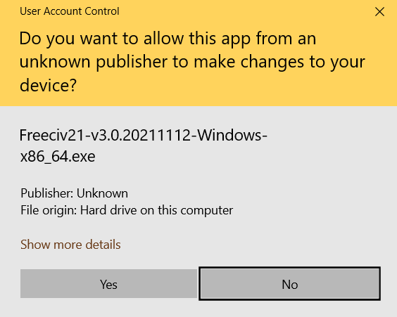

Windows Installation
********************

The Freeciv21 community provides a Microsoft Windows\ |reg| installer when new releases are tagged. The
following is instructions for installing on Windows.

To obtain the installer, go to the Freeciv21 `Releases <https://github.com/longturn/freeciv21/releases>`_
page. Each release has an assets section and the Windows installer and its hash are included. Click to
download and double-click the file to run.

.. _admin:

Local Admin Installation
========================

The following steps assume you :emphasis:`are` logged on as a local Administrator. If you :emphasis:`are
not` then jump to the non-admin_ section below.

If you :emphasis:`are` logged on as a local Administrator, a Windows User Access Control (UAC) window will
appear and ask: "Do you want to allow this app from an unknown publisher to make changes to your device".
Click :guilabel:`Yes` and the welcome panel will load after an uncompress process has completed.

|

Click :guilabel:`Next` to continue...

.. image:: ../_static/images/windows-installer/01-Welcome.png
    :align: center
    :height: 400
    :alt: Welcome Panel

|

By default, the installer only installs the client, server and modpack installer. If you want other
utilities, you will need to pick them from the list. Click :guilabel:`Next` to continue...

.. image:: ../_static/images/windows-installer/03-Components.png
    :align: center
    :height: 400
    :alt: Select Components Panel

|

Select the installation type and then click :guilabel:`Next` to continue...

.. image:: ../_static/images/windows-installer/04-Admin-Multi-User.png
    :align: center
    :height: 400
    :alt: Admin Installation Panel

|

By default, the Admin installer will place the files in the :file:`C:\\Program Files` folder. Change if
you want and click :guilabel:`Next` to continue...

.. image:: ../_static/images/windows-installer/05a-Admin-Folder.png
    :align: center
    :height: 400
    :alt: Admin Instalation Folder Panel

|

This panel shows the files being installed. No action is needed.

.. image:: ../_static/images/windows-installer/06-Copy-Files.png
    :align: center
    :height: 400
    :alt: Copying Files Panel

|

If you want to run Freeciv21 right away, leave the box checked and click :guilabel:`Finish`. Otherwise,
uncheck the box before clicking :guilabel:`Finish` to complete the installation.

.. image:: ../_static/images/windows-installer/07-Finish.png
    :align: center
    :height: 400
    :alt: Finish Panel

|

You will find an icon for the client on the Desktop or in the Start Menu at
:menuselection:`Start Menu --> Freeciv21 --> Freeciv21 Client`.

.. _non-admin:

Non-Local Admin (Unpriviledged User) Instalation
================================================

If you :emphasis:`are not` logged on as a local Administrator there is no UAC prompt and the following panel
will load after an uncompress process has completed.

Click :guilabel:`Next` to continue...

.. image:: ../_static/images/windows-installer/01-Welcome.png
    :align: center
    :height: 400
    :alt: Welcome Panel

|

By default, the installer only installs the client, server and modpack installer. If you want other
utilities, you will need to pick them from the list. Click :guilabel:`Next` to continue...

.. image:: ../_static/images/windows-installer/03-Components.png
    :align: center
    :height: 400
    :alt: Select Components Panel

|

The Non-Admin Installer places the files in your User Directory by default. Change if you want and click
:guilabel:`Next` to continue...

.. image:: ../_static/images/windows-installer/05b-User-Folder.png
    :align: center
    :height: 400
    :alt: User Instalation Folder Panel

|

This panel shows the files being installed. No action is needed.

.. image:: ../_static/images/windows-installer/06-Copy-Files.png
    :align: center
    :height: 400
    :alt: Copying Files Panel

|

If you want to run Freeciv21 right away, leave the box checked and click :guilabel:`Finish`. Otherwise,
uncheck the box before clicking :guilabel:`Finish` to complete the installation.

.. image:: ../_static/images/windows-installer/07-Finish.png
    :align: center
    :height: 400
    :alt: Finish Panel

|

You will find an icon for the client on the Desktop or in the Start Menu at
:menuselection:`Start Menu --> Freeciv21 --> Freeciv21 Client`.

.. |reg|    unicode:: U+000AE .. REGISTERED SIGN
