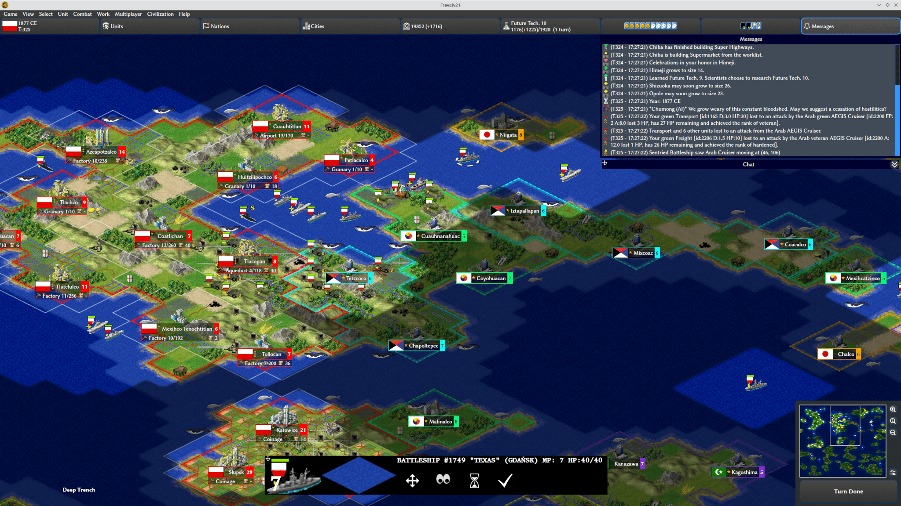

.. SPDX-License-Identifier: GPL-3.0-or-later
.. SPDX-FileCopyrightText: James Robertson <jwrober@gmail.com>

.. Custom Interpretive Text Roles for longturn.net/Freeciv21
.. role:: unit
.. role:: improvement
.. role:: wonder
.. role:: advance

Main Game Interface
*******************

Regardless the method you used to get into a game, eventually you will make it to the main game interface as
shown in :numref:`Game Overview` below. This is known as the :ref:`Map View <game-manual-map-view>`.

.. _Game Overview:

    Freeciv21 Game Overview

The game interface is broken down into a collection of sections. From the top, the sections are:

* :strong:`Menu Bar`: Like many programs, Freeciv21 has a menu bar at the top. For details see :doc:`menu`.
* :strong:`Top Function Bar`: This top bar is a big aspect of playing any Freeciv21 game. More details are
  available in the :doc:`top-bar` section.
* :strong:`The Main Map`: This is the main canvas of the game. This is where your empire will either thrive
  or be destroyed by your enemies. Refer to :ref:`Map View <game-manual-map-view>` for more information.
* :strong:`Unit Controls`: :numref:`Game Overview` shows a :unit:`Battleship` selected and the available
  unit actions in a bar at the bottom middle of the interface. This is the :doc:`unit-controls` bar.
* :strong:`Minimap`: In the lower right corner of the main map interface is a small version of the map known
  as the :doc:`mini-map`.
