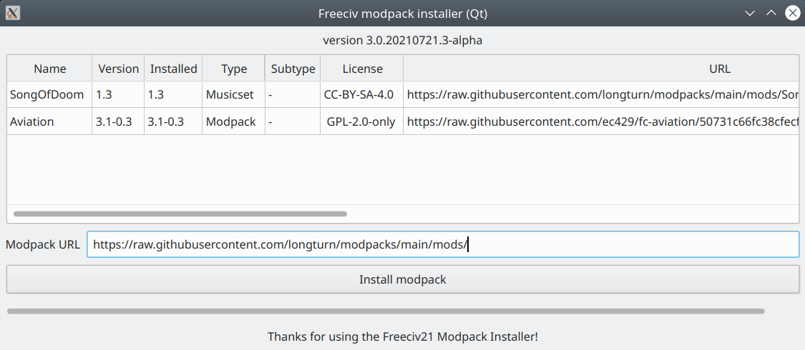

Using the Modpack Installer Utility
***********************************

Installing Modpacks
===================

The modpack installer is a simple tool to download custom Freeciv21 content called :strong:`modpacks` from 
the Internet, and automatically install them into the correct location to be used by the Freeciv21 client and 
server.

A :strong:`modpack` can consist of one or more of:

* :strong:`rulesets` for game rules
* :strong:`scenarios` for game maps (with or without players/cities/etc)
* :strong:`tilesets` for game graphics
* :strong:`soundsets` or :strong:`musicsets` for sound effects and in-game music

They can be installed using the modpack installer tool :file:`freeciv21-modpack-qt` that comes with the 
standard installation. There is also a command-line-only tool called :file:`freeciv21-modpack`, which is 
mainly useful for headless game servers.

In standard Freeciv21 builds, when you start the graphical modpack installer, it will show a list of 
modpacks curated by the Freeciv21 developers and longturn.net community. You can select one and click 
:guilabel:`Install modpack`; the tool will download the files for the selected modpack, and any other 
modpacks it depends on, and install them ready for the main Freeciv21 programs to use.

You can also point the installer at modpacks or lists on other servers:

* If someone has given you an individual modpack URL (ending in :literal:`.json`), you can paste it into the 
  :guilabel:`Modpack URL` box, and when you click :guilabel:`Install modpack`, the modpack will immediately  
  downloaded and install. 

.. note:: If you have been given a URL ending up :literal:`.modpack` or :literal:`.mpdl`, 
    that is probably for legacy Freeciv and not Freeciv21.

* If someone has given you a URL for a list of modpacks (also ending in :literal:`.json`) and you want to 
  browse them with the standard Freeciv21 modpack installer build, you need to start the tool with that URL  
  on its command line, for instance:

.. code-block:: rst

    freeciv21-modpack --List https://example.com/3.1/my-modpacks.list

.. note:: The capital letter in :literal:`--List`

    The tool has some other command-line options, but most users will not need to use them. Use 
    :literal:`--help` for a list of them.

Once you have installed a modpack, how you use it depends on the modpack type:

* Scenarios (maps) should be listed under :guilabel:`Start scenario game` from the client start page, or 
  from the game server prompt via :literal:`/list scenarios`.

.. tip:: For network play, scenarios need only be installed on the game server.

* Rulesets should appear on the :guilabel:`Ruleset` drop-down from the client's :guilabel:`Start new game` 
  page. On the game server, you can load a ruleset with :literal:`/read <name>` or failing that perhaps 
  :literal:`/set rulesetdir <name>`.

* Tilesets should appear for selection in the local client options, in the appropriate topology-specific 
  :guilabel:`Tileset` drop-down under :guilabel:`Graphics`.

.. note:: Tilesets should be installed on the client machine.

* Soundsets and musicsets should appear in the dropdowns on the :guilabel:`Sound` page of the local 
  client options.

With standard Freeciv21 builds, modpacks get installed into a per-user area, not into the main Freeciv21 
installation. So you shouldn't need any special permissions to download them, and if you uninstall the 
Freeciv21 game, any modpacks you downloaded are likely to remain on your system. Conversely, if you delete 
downloaded modpacks by hand, the standard rulesets, tilesets, etc. supplied with Freeciv21 won't be touched.

The precise location where files are downloaded to depends on your build and platform. For Unix systems, it 
is likely to be under the hidden :file:`~/.local/share/freeciv21` directory in your home directory. For 
Windows based sytems it will be in your user profile directory in a hidden :literal:`AppData` folder, 
typically, :file:`C:\\Users\\[MyUserName]\\AppData\\Roaming\\Freeciv21` It is likely to be near where the 
Freeciv21 client stores its saved games.

Most modpacks are specific to a particular major version of Freeciv21; for instance, while a 3.0 ruleset or 
tileset can be used with all Freeciv21 3.0.x releases, it cannot be used as-is with any 3.1.x release. So, 
most modpacks are installed in a specific directory for the major version, such as 
:file:`~/.local/share/freeciv21/3.1/` on Unix. 

.. note:: The modpack installer displays which version it will install for at the top of its window.

An exception to this is scenario maps; scenarios created for one version of Freeciv21 can usually be loaded 
in later versions, so they are installed in a version-independent location (typically 
:file:`~/.local/share/freeciv21/scenarios/` on Unix).

Once a modpack is installed, there is no uninstall action, and if you remove the files by hand, the 
installer will still consider the modpack to be installed; the installer maintains its own database 
(:file:`.control/modpacks.db`) listing which modpack versions are installed, but does not keep track of 
which files were installed by which modpack. If the database gets out of sync with reality (or is deleted), 
it's harmless for already installed modpacks and the main Freeciv21 programs (which do not consult the 
database), but can confuse the modpack installer's dependency tracking later.

Modpacks consist mostly of data files read by the Freeciv21 engine; they do not contain compiled binary code 
(and are thus platform-independent). Rulesets can contain code in the form of Lua scripts, but this is 
executed in a sandbox to prevent obvious security exploits. Modpacks are installed to a specific area and 
cannot overwrite arbitrary files on your system. Nevertheless, you should only install modpacks from sources 
you trust.

Serving Modpacks for the Installer
==================================

The rest of this document discusses how to set up a web server so that users can download modpacks you 
publish.

.. note::  If you just want to install modpacks, you need not read on.

To host modpacks, you just need a web server that can host plain static files; you do not need to run any 
custom code or frameworks on that web server, just to publish files with a specific layout, detailed below.

On the modpack server, there are up to three layers of files required:

1. A list of available modpacks (optional, advanced).
2. One control file per modpack.
3. The individual files comprising the modpacks.

Each of these layers is described in detail below.

Each layer refers to files in the next layer down. References can be with relative URLs (so that a modpack 
or set of modpacks can be moved without changing any file contents), or with absolute URLs (so that the 
different layers can be hosted on different web servers).

Almost all of these file formats are specific to one major version of Freeciv21; this document only 
describes the formats for the major version of Freeciv21 it is shipped with.

1. List of Modpacks
-------------------

This is only needed if you want to let users browse a list of available modpacks before choosing one to 
install. To look at your modpack list instead of the standard one, users will usually have to start the 
modpack installer with non-standard arguments (see above).

The modpack list is a standard :literal:`JSON` file with a specific structure.

Here's an example:

.. code-block:: rst

    {
      "info": {
        "options": "+modpack-index-1.0",
        "message": "Example modpack list loaded successfully"
      },
      "modpacks": [
        {
          "name": "Example",
          "version": "0.0",
          "license": "WTFPL",
          "type": "Modpack",
          "url": "https://example.com/example.json",
          "notes": "This is an example"
        }
      ]
    }

This file uses the modpack index format version 1.0, as is indicated in the :literal:`info.options` field. 
The optional :literal:`info.message` is displayed on the status line when the modpack installer starts up. 
It should be kept to one line.

The modpacks list contains a list of modpacks. This example contains just one modpack. Each modpack may 
contain the following fields:

"name", "version", "type"
  These three fields should match those in the :literal:`.json` file which :literal:`URL` links to.

"subtype"
  Optional free text. For tilesets or scenarios, conventionally indicates the map topology with one of 
  :literal:`overhead`, :literal:`iso`, :literal:`hex`, or :literal:`hex & iso` (and these will be 
  localised). Otherwise use :literal:`-`.

"license"
  Free text summarising the distribution terms for the modpack content, by naming a well-known license, not 
  quoting the full license text! Consider using SPDX identifiers (https://spdx.org/licenses/).

"URL"
  The URL to a :literal:`.json` file for the individual modpack. The URL can be either relative in which 
  case it's relative to the URL of :literal:`modpack.list`, or absolute - which can be on some other web 
  server.

"notes"
   Optional free text; usually shown as a tooltip.

2. Control File: Dfining an Individual Modpack
----------------------------------------------

This is the core control file for a modpack, specifying what files it contains, where to download them from, 
and where they are installed.

Some modpack authors will just publish the URL of an :literal:`.json` file directly, for users to give to 
the modpack installer tool. There doesn't have to be a :literal:`modpack.list` file anywhere that refers to 
the :literal:`.json` file.

Again, this is a file in standard :literal:`JSON` format. Its filename must end in :literal:`.json`.

Here is an example of a modpack control file:

.. code-block: rst

    {
      "info": {
        "options": "+modpack-1.0",
        "base_url": ".",
        "name": "Some ruleset",
        "type": "Modpack",
        "version": "0.0"
      },
      "files": [
        "some_ruleset.serv",
        "some_ruleset.tilespec",
        "some_ruleset/nation/german.ruleset",
        "some_ruleset/nation/indian.ruleset",
        ...
      ]
    }

The :literal:`info` section has overall control information:

"options"
  Defines the version of the file format. Should be exactly as shown in the example.
  
"name"
  A short name for the modpack. This is used for version and dependency tracking, so should not 
  contain minor version information, and should not change once a modpack has been released for a given 
  major version of Freeciv21. Case-insensitive.

"version"
  Textual version information. If another modpack uses this one as a dependency, this string is 
  subject to version number comparison (using the rules of Freeciv21's :literal:`cvercmp` library, which 
  should give sensible results for most version numbering schemes).
  
"type"
  This must be one of the following:

* :strong:`Ruleset`: :literal:`foo.serv`, :literal:`foo/*.ruleset`, :literal:`foo/*.lua`, etc.
* :strong:`Tileset`: :literal:`foo.tilespec`, :literal:`foo/*.png`, etc.
* :strong:`Soundset`: :literal:`foo.soundspec`, :literal:`foo/*.ogg`, etc.
* :strong:`Musicset`: :literal:`foo.musicspec`, :literal:`foo/*.ogg`, etc.
* :strong:`Scenario`: :literal:`foo.sav`; installed to a version-independent location.
* :strong:`Modpack`: Conventionally used for modpacks that contain more than one of the above kinds of material
* :strong:`Group`: Contains no files but only depends on other modpacks At the moment, only 
  :literal:`Scenario` causes special behavior.
 
"base_url"
  URL to prepend to the :literal:`src` filenames in the :literal:`files` list. May be relative to the 
  :literal:`.json` file -- starting with :literal:`./` -- or absolute in which case the files can be on some 
  web server different to where the :literal:`.json` file lives.

The :strong:`files` list defines the individual files comprising your modpack. It must list every file 
individually; any files in the same directory on the webserver that are not listed will not be downloaded. 
Entries can be strings as shown above, in which case the same file name is used for downloading relative to 
:literal:`info.base_url` and installing relative to the data directory. If the installed name is different 
from the name on the server, the following syntax can be used instead:

.. code-block: rst

    {
      "url": "some-remote-file",
      "dest": "where-to-install-it"
    }

The URL can be either relative (to :literal:`info.base_url`) or absolute. The two syntaxes can be mixed in 
the same modpack.

.. note:: Forward slash :literal:`/` (and not backslash :literal:`\\`) should be used to separate directories.

Some advice on the structure of files in modpacks:

* You should generally install files in a directory named after the modpack, with a few exceptions 
  (:literal:`.serv`, :literal:`.tilespec`, :literal:`.soundspec`, and :literal:`.musicspec` files must be 
  installed to the top level, and should reference files in your subdirectory). Individual files and 
  directories install names should usually not embed version numbers, dates, etc., so that when a new version 
  of modpack X is installed, it cleanly overwrites the old   version, rather than leaving both cluttering up 
  the user's installation.

* The modpack installer does not stop different modpacks overwriting each other's files, so published 
  modpacks should be disciplined about namespace usage. If you've derived from someone else's modpack, you 
  should probably give your derivative new filenames, so that both can be installed simultaneously.

* There is no :emphasis:`white-out` facility to delete files from a user's installation -- if a newer 
  version of a modpack has fewer files than an old one, the old file will persist in some users' 
  installations, so your modpacks should be designed to be tolerant of that.

* At the moment, there is no restriction on what kind of files a given :emphasis:`type` can install, but 
  modpacks should stick to installing the advertised kinds of content. It's :strong:`OK` to install extra 
  files such as documentation in any case (:file:`LICENSE/COPYING`, :file:`README.txt`, etc.).

* If your modpack contains a ruleset, you should usually install a :literal:`.serv` file at the top level 
  (which can be a one-line file consisting of :literal:`rulesetdir <name>`, as this is needed for the server 
  to enumerate the available rulesets.

In some cases, a modpack may depend on other modpacks, for instance if it reuses some of their files. This 
can be handled by declaring a dependency with respect to the other modpack. Dependencies are listed in the 
optional :literal:`dependencies` list of the :literal:`JSON` file. Each entry in that list must contain the 
following object:

.. code-block: rst

    {
      "modpack": "...",
      "url": "...",
      "type": "...",
      "version": "..."
    }

The keys are explained below:

* :strong:`modpack`: What the dependency modpack calls itself when installed (that is, :literal:`name` 
  from its :literal:`.json` file).
* :strong:`url`: URL to download modpack if needed. Can be relative or absolute.
* :strong:`type`:  Must match :literal:`type` from dependency's :literal:`.json` file.
* :strong:`version`: Minimum version of dependency (as declared in its :literal:`.json` file). Subject to 
  version number comparison algorithm.

If the modpack installer thinks the required version, or a newer version, of the dependency is already 
installed, it will do nothing, otherwise it will download the dependency modpack, and any of its own 
dependencies, recursively.

3. Individual Modpack Files
---------------------------

These are the files comprising the modpack (:literal:`*.ruleset`, :literal:`*.png`, etc.), that will be 
copied verbatim to the user's Freeciv21 profile directory and read by the Freeciv21 client and server. The 
modpack installer does not modify the files in any way.

The files must be hosted individually on the web server; the modpack installer tool cannot unpack any 
archives such as :file:`.zip` files. Individual scenarios can be compressed (e.g. :file:`.sav.gz`, as the 
Freeciv21 engine can uncompress these files.

Because the :literal:`*.json` file can change the file paths / names on download, the layout on the modpack server 
doesn't have to correspond with the installed layout. An individual file can be shared between multiple 
modpacks, if you want.

How to write modpacks is beyond the scope of this document -- see :file:`README.rulesets`, 
:file:`README.graphics`, etc. in the :file:`doc` directory for some clues.
